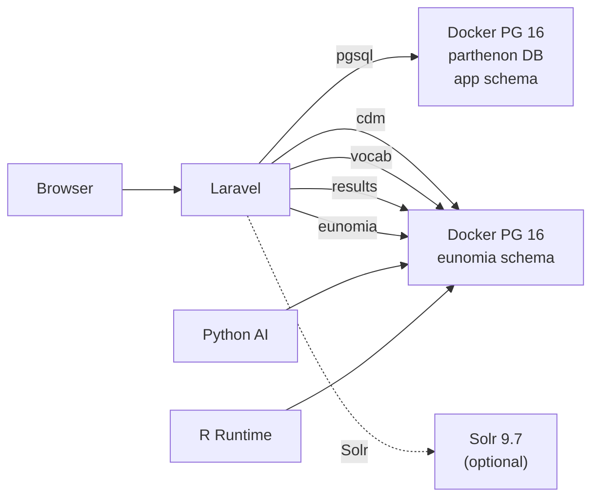
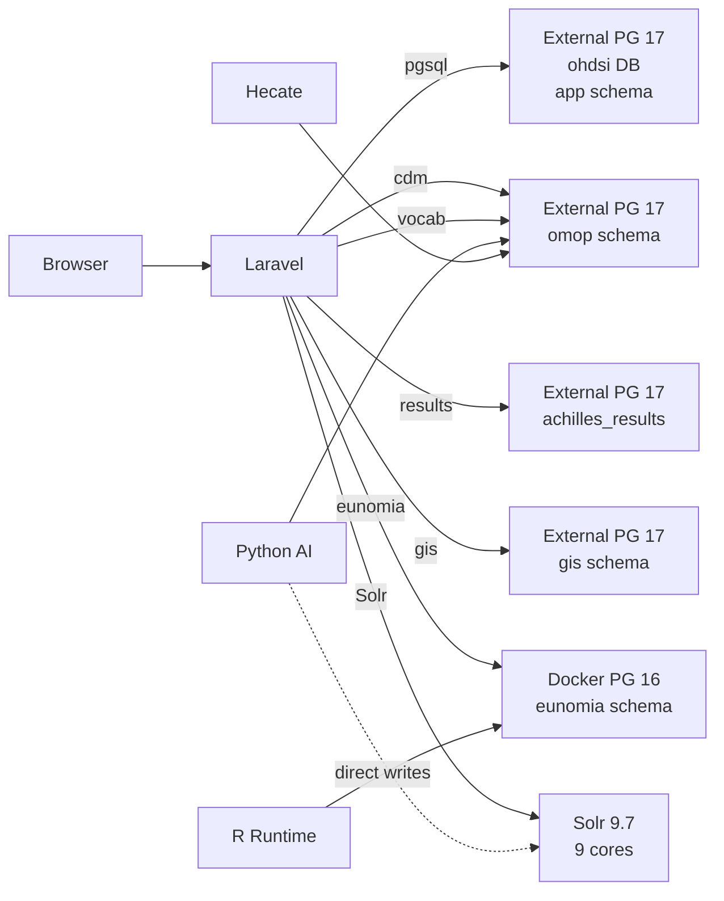
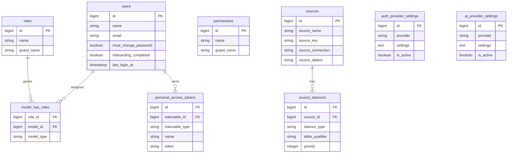
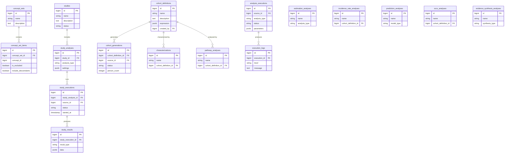
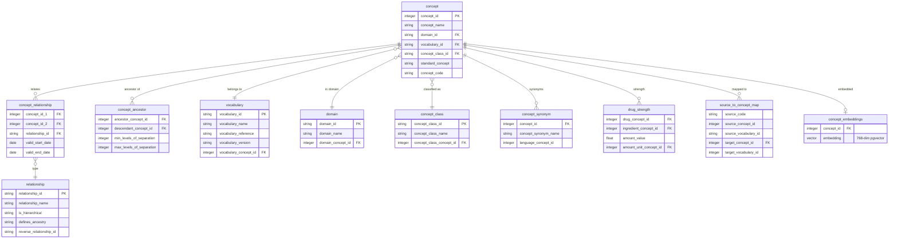
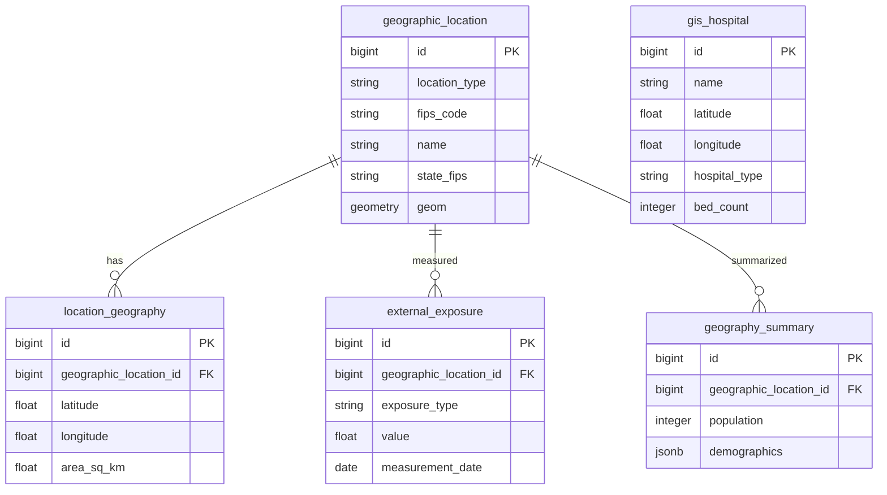
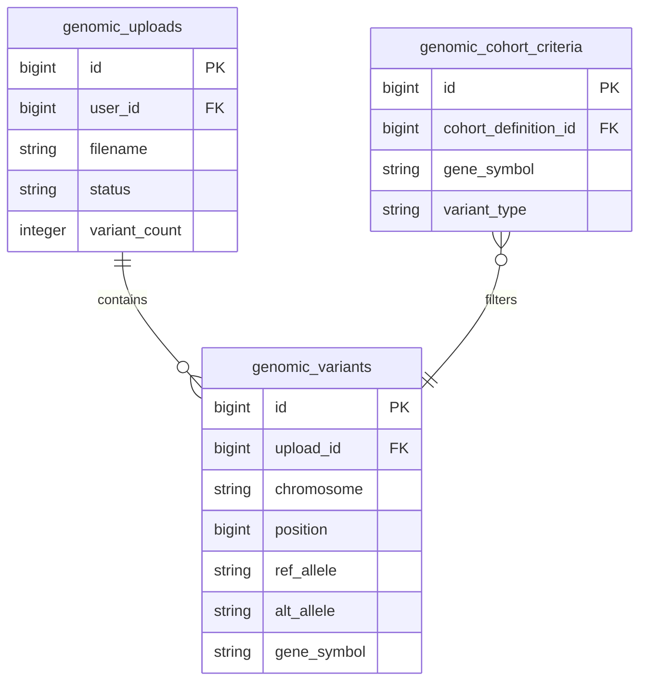
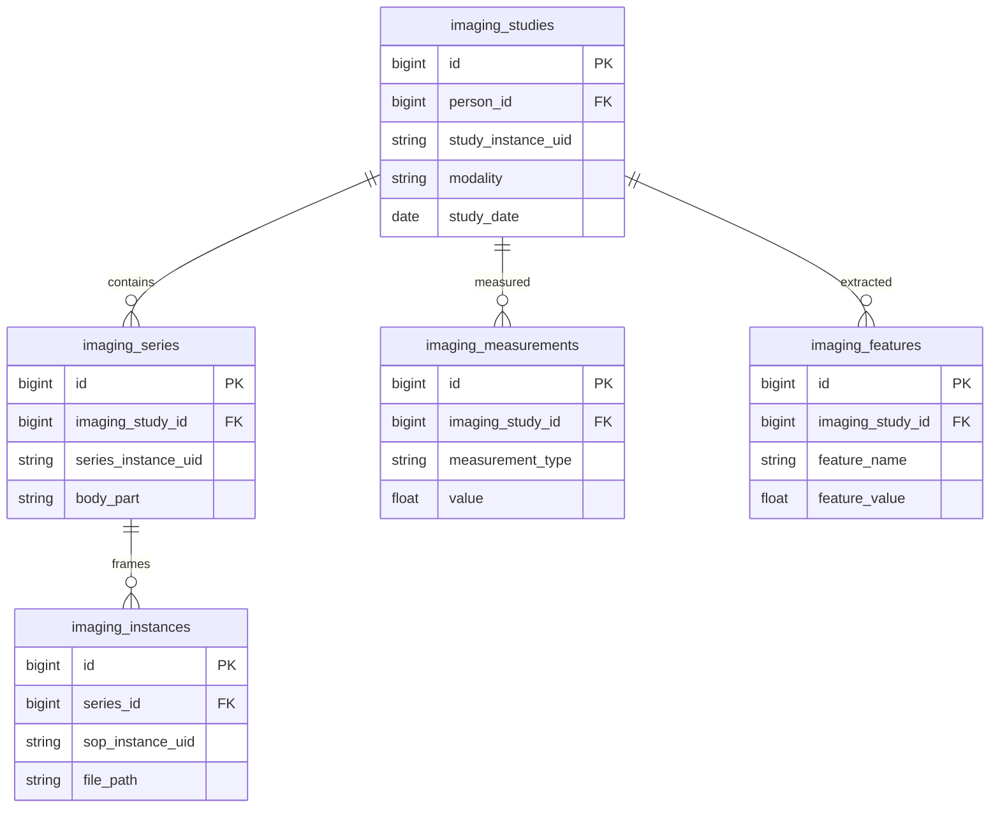
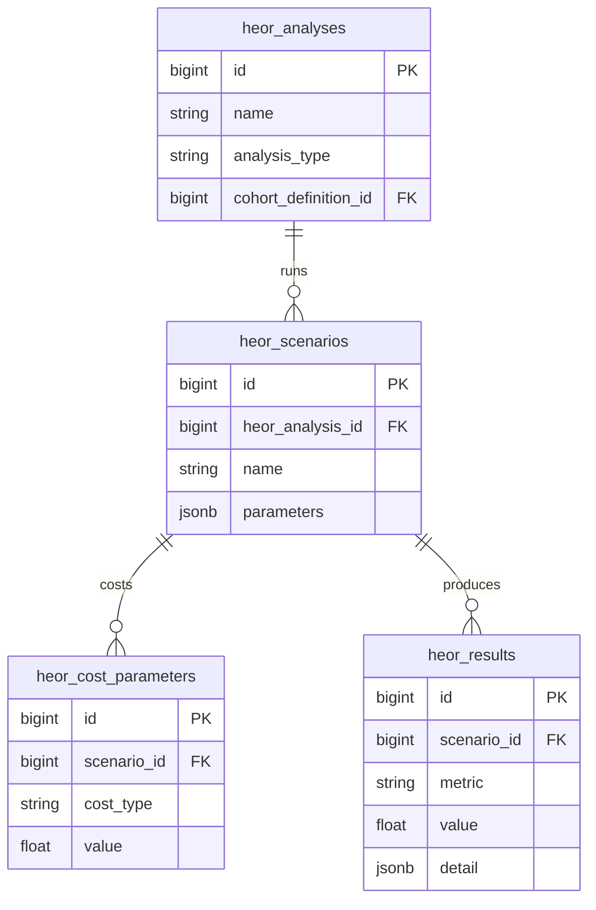

# Database Architecture Documentation — Implementation Plan

> **For agentic workers:** REQUIRED: Use superpowers:subagent-driven-development (if subagents available) or superpowers:executing-plans to implement this plan. Steps use checkbox (`- [ ]`) syntax for tracking.

**Goal:** Create a comprehensive onboarding document explaining Parthenon's dual-database + Solr architecture, with 5 domain ERDs and an automated `php artisan db:audit` diagnostic command.

**Architecture:** A single Markdown guide at `docs/architecture/database-architecture.md` with embedded Mermaid diagrams (rendered by GitHub/Docusaurus). A standalone Artisan command (`DatabaseAudit`) queries all 7 PG connections + 9 Solr cores and produces a formatted console table. Feature test validates command output structure.

**Tech Stack:** Laravel 11 Artisan, Pest PHP tests, Mermaid ERD syntax, PostgreSQL `pg_tables`/`pg_stat_user_tables` system views, SolrClientWrapper HTTP client.

**Spec:** `docs/superpowers/specs/2026-03-12-database-architecture-docs-design.md`

---

## File Structure

| Action | Path | Responsibility |
|--------|------|---------------|
| Create | `docs/architecture/database-architecture.md` | Narrative guide with 8 sections + 5 embedded ERDs |
| Create | `backend/app/Console/Commands/DatabaseAudit.php` | `php artisan db:audit` command |
| Create | `backend/tests/Feature/Commands/DatabaseAuditTest.php` | Pest feature test for the command |

---

## Chunk 1: Database Audit Command (TDD)

### Task 1: Write the failing test for db:audit

**Files:**
- Create: `backend/tests/Feature/Commands/DatabaseAuditTest.php`

- [ ] **Step 1: Write the Pest test file**

```php
<?php

use Illuminate\Support\Facades\Artisan;

test('db:audit command runs successfully', function () {
    $this->artisan('db:audit')
        ->assertExitCode(0);
});

test('db:audit outputs connection table with expected columns', function () {
    $this->artisan('db:audit')
        ->expectsOutputToContain('Connection')
        ->expectsOutputToContain('Schema')
        ->expectsOutputToContain('Tables')
        ->assertExitCode(0);
});

test('db:audit --json outputs valid JSON', function () {
    Artisan::call('db:audit', ['--json' => true]);
    $output = Artisan::output();

    $decoded = json_decode(trim($output), true);
    expect($decoded)->toBeArray();
    expect($decoded)->not->toBeEmpty();

    // Each entry should have the expected keys
    expect($decoded[0])->toHaveKeys(['connection', 'schema', 'tables', 'rows', 'status']);
});

test('db:audit --connection filters to single connection', function () {
    Artisan::call('db:audit', ['--json' => true, '--connection' => 'pgsql']);
    $output = Artisan::output();

    $decoded = json_decode(trim($output), true);
    expect($decoded)->toBeArray();
    expect($decoded)->toHaveCount(1);
    expect($decoded[0]['connection'])->toBe('pgsql');
});

test('db:audit handles connection failure gracefully', function () {
    // Override a connection to point to a non-existent host
    config(['database.connections.gis.host' => '192.0.2.1']); // RFC 5737 TEST-NET
    config(['database.connections.gis.connect_timeout' => 1]);

    $this->artisan('db:audit --connection=gis')
        ->expectsOutputToContain('FAIL')
        ->assertExitCode(0); // informational tool, never fails
});
```

- [ ] **Step 2: Run test to verify it fails**

Run: `cd backend && vendor/bin/pest tests/Feature/Commands/DatabaseAuditTest.php --colors`
Expected: FAIL — "Unable to locate … db:audit" (command doesn't exist yet)

- [ ] **Step 3: Commit test skeleton**

```bash
git add backend/tests/Feature/Commands/DatabaseAuditTest.php
git commit -m "test: add failing tests for db:audit command"
```

---

### Task 2: Implement the DatabaseAudit command

**Files:**
- Create: `backend/app/Console/Commands/DatabaseAudit.php`

**Context:**
- Existing pattern: `SyncDatabaseCommand.php` uses `DB::connection($conn)->getPdo()` for connectivity checks
- `SolrClientWrapper` has `ping(core)` and `documentCount(core)` methods
- The 7 PG connections are: `pgsql`, `cdm`, `vocab`, `results`, `gis`, `eunomia`, `docker_pg`
- The 9 Solr cores are defined in `config('solr.cores')` — see `backend/config/solr.php`
- `pg_tables` system view has columns: `schemaname`, `tablename`
- `pg_stat_user_tables` has `schemaname`, `relname`, `n_live_tup` (approximate row count)

- [ ] **Step 4: Create the command file**

```php
<?php

namespace App\Console\Commands;

use App\Services\Solr\SolrClientWrapper;
use Illuminate\Console\Command;
use Illuminate\Support\Facades\DB;

class DatabaseAudit extends Command
{
    protected $signature = 'db:audit
        {--json : Output as JSON for CI/scripting}
        {--connection= : Audit a single connection only}';

    protected $description = 'Audit all database connections and Solr cores — shows schemas, table counts, row counts, and discrepancies';

    /** Connections to audit and the schemas we expect to find data in. */
    private const PG_CONNECTIONS = [
        'pgsql'     => ['label' => 'App (pgsql)',     'expect_data' => true],
        'cdm'       => ['label' => 'CDM',             'expect_data' => true],
        'vocab'     => ['label' => 'Vocabulary',       'expect_data' => true],
        'results'   => ['label' => 'Results',          'expect_data' => true],
        'gis'       => ['label' => 'GIS',              'expect_data' => false],
        'eunomia'   => ['label' => 'Eunomia',          'expect_data' => false],
        'docker_pg' => ['label' => 'Docker PG',        'expect_data' => true],
    ];

    public function handle(): int
    {
        $filter = $this->option('connection');
        $asJson = $this->option('json');

        $report = [];

        // --- PostgreSQL connections ---
        foreach (self::PG_CONNECTIONS as $name => $meta) {
            if ($filter && $filter !== $name) {
                continue;
            }

            $report[] = $this->auditPgConnection($name, $meta);
        }

        // --- Solr cores ---
        if (! $filter || $filter === 'solr') {
            $solrRows = $this->auditSolr();
            $report = array_merge($report, $solrRows);
        }

        if ($asJson) {
            $this->line(json_encode($report, JSON_PRETTY_PRINT | JSON_UNESCAPED_UNICODE));

            return self::SUCCESS;
        }

        $this->renderTable($report);

        return self::SUCCESS;
    }

    /**
     * @param  array{label: string, expect_data: bool}  $meta
     * @return array{connection: string, schema: string, tables: int|string, rows: int|string, status: string}
     */
    private function auditPgConnection(string $name, array $meta): array
    {
        try {
            $pdo = DB::connection($name)->getPdo();
        } catch (\Throwable $e) {
            return [
                'connection' => $name,
                'schema'     => '—',
                'tables'     => '—',
                'rows'       => '—',
                'status'     => 'FAIL: ' . $this->truncate($e->getMessage(), 60),
            ];
        }

        // Get the first schema from search_path for display
        $searchPath = config("database.connections.{$name}.search_path", 'public');
        $schema = explode(',', $searchPath)[0];

        // Count tables in that schema
        $tables = DB::connection($name)
            ->table('pg_tables')
            ->where('schemaname', $schema)
            ->count();

        // Approximate row count via pg_stat_user_tables
        $rowCount = DB::connection($name)
            ->table('pg_stat_user_tables')
            ->where('schemaname', $schema)
            ->sum('n_live_tup');

        $status = 'OK';
        if ($tables === 0 && $meta['expect_data']) {
            $status = 'WARN: empty schema';
        }

        return [
            'connection' => $name,
            'schema'     => $schema,
            'tables'     => $tables,
            'rows'       => $rowCount,
            'status'     => $status,
        ];
    }

    /**
     * @return list<array{connection: string, schema: string, tables: int|string, rows: int|string, status: string}>
     */
    private function auditSolr(): array
    {
        $rows = [];

        if (! config('solr.enabled', false)) {
            $rows[] = [
                'connection' => 'Solr',
                'schema'     => '—',
                'tables'     => '—',
                'rows'       => '—',
                'status'     => 'DISABLED (SOLR_ENABLED=false)',
            ];

            return $rows;
        }

        /** @var SolrClientWrapper $solr */
        $solr = app(SolrClientWrapper::class);
        $cores = config('solr.cores', []);

        foreach ($cores as $key => $coreName) {
            $ping = $solr->ping($coreName);

            if (! $ping) {
                $rows[] = [
                    'connection' => 'Solr',
                    'schema'     => $coreName,
                    'tables'     => '1 core',
                    'rows'       => '—',
                    'status'     => 'FAIL: unreachable',
                ];

                continue;
            }

            $count = $solr->documentCount($coreName);
            $status = 'OK';
            if ($count === 0 || $count === null) {
                $status = 'WARN: 0 documents';
            }

            $rows[] = [
                'connection' => 'Solr',
                'schema'     => $coreName,
                'tables'     => '1 core',
                'rows'       => $count ?? 0,
                'status'     => $status,
            ];
        }

        return $rows;
    }

    /**
     * @param  list<array{connection: string, schema: string, tables: int|string, rows: int|string, status: string}>  $report
     */
    private function renderTable(array $report): void
    {
        $this->newLine();
        $this->info('Parthenon Database Audit');
        $this->info(str_repeat('─', 40));
        $this->newLine();

        $headers = ['Connection', 'Schema', 'Tables', 'Total Rows', 'Status'];
        $tableRows = [];

        foreach ($report as $row) {
            $rows = is_numeric($row['rows']) ? number_format((int) $row['rows']) : $row['rows'];
            $status = $row['status'];

            // Colorize status
            if (str_starts_with($status, 'FAIL')) {
                $status = "<fg=red>{$status}</>";
            } elseif (str_starts_with($status, 'WARN')) {
                $status = "<fg=yellow>{$status}</>";
            } elseif (str_starts_with($status, 'DISABLED')) {
                $status = "<fg=gray>{$status}</>";
            } else {
                $status = "<fg=green>{$status}</>";
            }

            $tableRows[] = [$row['connection'], $row['schema'], $row['tables'], $rows, $status];
        }

        $this->table($headers, $tableRows);
    }

    private function truncate(string $text, int $length): string
    {
        return strlen($text) > $length ? substr($text, 0, $length) . '…' : $text;
    }
}
```

- [ ] **Step 5: Run tests to verify they pass**

Run: `cd backend && vendor/bin/pest tests/Feature/Commands/DatabaseAuditTest.php --colors`
Expected: All 5 tests PASS (the connection-failure test may need a short timeout adjustment)

- [ ] **Step 6: Run the command manually to verify output**

Run: `docker compose exec php php artisan db:audit`
Expected: Formatted table with all connections + Solr status

Run: `docker compose exec php php artisan db:audit --json`
Expected: Valid JSON array

- [ ] **Step 7: Commit command + passing tests**

```bash
git add backend/app/Console/Commands/DatabaseAudit.php backend/tests/Feature/Commands/DatabaseAuditTest.php
git commit -m "feat: add php artisan db:audit command with tests"
```

---

## Chunk 2: Architecture Guide — Narrative Sections

### Task 3: Create the architecture guide with sections 1-6

**Files:**
- Create: `docs/architecture/database-architecture.md`

**Context:**
- The spec defines 8 sections for Deliverable 1
- Connection details come from `backend/config/database.php` (already read above)
- Solr config from `backend/config/solr.php`
- This is a static Markdown document with Mermaid diagrams — no code changes needed

- [ ] **Step 8: Create docs/architecture/ directory**

```bash
mkdir -p docs/architecture
```

- [ ] **Step 9: Write the architecture guide (sections 1-8, no ERDs yet)**

Create `docs/architecture/database-architecture.md` with the following content. This is the full narrative guide — ERDs are added in Task 4.

```markdown
# Parthenon Database Architecture

> **Reading time:** ~15 minutes
> **Audience:** Developers onboarding to the Parthenon codebase
> **Last updated:** 2026-03-12

---

## 1. The Two-Database Pattern

Parthenon splits data across two PostgreSQL instances. This is intentional — not technical debt.

**Docker PG 16** (`parthenon` database, port 5480)
- Portable application metadata: users, roles, cohort definitions, studies, analyses, concept sets
- Created from scratch by `docker compose up` + Laravel migrations
- Lightweight, disposable, re-seedable
- ~104 tables in the `app` schema

**External PG 17** (`ohdsi` database, port 5432)
- Operational data store: the real OMOP CDM v5.4
- 1M+ patients, 1.8B+ clinical observations, 7.2M vocabulary concepts
- Achilles characterization results, GIS extension tables
- Hundreds of GB, ETL'd from claims/EHR sources — too large to containerize

This mirrors the standard OHDSI deployment pattern. Atlas/WebAPI uses the same split: app tier separate from CDM tier. Parthenon makes it explicit with named Laravel connections.

### What Happens After `docker compose up`

Docker PG gets:
- `app` schema with all Laravel migration tables (users, roles, sources, etc.)
- Empty `vocab`, `cdm`, `achilles_results`, `eunomia` schemas (created by `docker/postgres/init.sql`)
- The empty OMOP schemas are **expected** — they're populated only when you run `parthenon:load-eunomia` or connect to an external PG

External PG (if configured) has:
- Full CDM + vocabulary in the `omop` schema
- Achilles results in `achilles_results` schema
- GIS data in the `gis` schema
- A mirror of the `app` schema (kept in sync via `db:sync`)

---

## 2. Connection Topology

Laravel routes queries through 7 named database connections. Which physical database each connection targets depends on the deployment profile.

### Docker-Only Profile (New Installs)

All connections point to Docker PG. CDM/vocab/results use the `eunomia` schema (2,694-patient GiBleed demo dataset).



### Acumenus Profile (Production)

`pgsql` points to External PG (not Docker). CDM/vocab/results target the `omop` and `achilles_results` schemas on External PG.



> **Key:** On Acumenus, `pgsql` points to External PG (`ohdsi` database) — **NOT** Docker PG. The `docker_pg` connection always targets Docker PG regardless of profile. On Docker-only installs, `pgsql` and `docker_pg` point to the same database.

---

## 3. Schema Inventory

### External PG 17 (`ohdsi`) — 15 schemas

| Schema | Tables | Purpose | Row Scale |
|--------|--------|---------|-----------|
| `omop` | 48 | Combined CDM v5.4 + vocabulary (Atlas/ETL convention) | 1.8B+ |
| `achilles_results` | 8 | Achilles characterization + DQD results | 1.8M |
| `app` | 112 | Application tables (mirror of Docker + 8 extra tables) | Thousands |
| `gis` | 5 | GIS extension (geographic_location, external_exposure, hospitals) | Thousands |
| `eunomia` | 20 | GiBleed demo CDM (2,694 patients) | 343K |
| `eunomia_results` | 4 | Achilles results for Eunomia demo | 64K |
| `webapi` | 105 | Legacy Atlas WebAPI tables (read-only, historical) | ~0 |
| `basicauth` | 8 | Legacy Atlas auth (unused) | ~0 |
| `vocab` | 11 | Empty — created by migrations, unused on Acumenus | 0 |
| `cdm` | 24 | Empty — created by migrations, unused on Acumenus | 0 |
| `staging` | 1 | ETL staging area | Variable |
| `topology` | — | PostGIS topology extension | System |
| `vocabulary` | — | Legacy schema alias | 0 |
| `results` | — | Legacy schema from Atlas era | 0 |
| `public` | — | Default PostgreSQL schema | System |

> The `app` schema on External PG has 8 more tables than Docker PG (112 vs 104). These include `genomic_variants` (17.8M rows) and `gis_admin_boundaries` (51K) — tables created by ETL scripts, not managed by Laravel migrations.

### Docker PG 16 (`parthenon`) — 7 schemas

| Schema | Tables | Purpose |
|--------|--------|---------|
| `app` | 104 | Application tables from Laravel migrations |
| `vocab` | 0 | Created by init.sql, empty (populated only via Eunomia seeder) |
| `cdm` | 0 | Created by init.sql, empty (populated only via Eunomia seeder) |
| `achilles_results` | 0 | Created by init.sql, empty |
| `eunomia` | 0 | Created by init.sql, populated by `parthenon:load-eunomia` |
| `public` | 1 | Laravel migrations tracking |
| `topology` | 2 | PostGIS topology extension |

---

## 4. The `omop` Schema Explained

The `omop` schema on External PG is a **combined CDM + vocabulary schema**. This is the standard Atlas/ETL convention — both clinical tables (person, visit_occurrence, condition_occurrence) and vocabulary tables (concept, concept_relationship, vocabulary) live in a single schema.

Parthenon's separate `cdm` and `vocab` Laravel connections both point here via `search_path` overrides in `.env`:

```env
CDM_DB_SEARCH_PATH=omop,public
VOCAB_DB_SEARCH_PATH=omop,public
```

The `omop` schema also contains ETL-specific tables not in the standard OMOP CDM specification:
- `claims`, `claims_transactions` — Insurance claims data
- `states_map` — Geographic state mapping
- `concept_embeddings` — pgvector 768-dim embeddings for AI semantic search

---

## 5. Laravel Connection Reference

| Connection | Env Prefix | Default Host | Default DB | Default search_path | Used By |
|------------|-----------|-------------|-----------|-------------------|---------|
| `pgsql` | `DB_*` | 127.0.0.1 | ohdsi (Acumenus) / parthenon (Docker) | app,public | All App models (User, Source, CohortDefinition, Study, etc.) |
| `cdm` | `CDM_DB_*` | 127.0.0.1 | parthenon | eunomia,public | CdmModel subclasses (Person, VisitOccurrence, Condition, etc.) |
| `vocab` | `DB_VOCAB_*` | 127.0.0.1 | parthenon | eunomia,public | VocabularyModel subclasses (Concept, ConceptRelationship, etc.) |
| `results` | `RESULTS_DB_*` | 127.0.0.1 | parthenon | eunomia_results,public | AchillesResultReaderService (overrides search_path per-request) |
| `gis` | `GIS_DB_*` | 127.0.0.1 | ohdsi | gis,omop,public,app | GIS services (SviAnalysisService, etc.) |
| `eunomia` | `DB_*` (shared with pgsql) | postgres | parthenon | eunomia,public | Eunomia demo dataset access |
| `docker_pg` | `DOCKER_DB_*` | postgres | parthenon | app,public | db:sync, db:audit comparison |

> **Gotcha:** Env var naming is inconsistent across connections. CDM uses `CDM_DB_*`, vocab uses `DB_VOCAB_*`, results uses `RESULTS_DB_*`, GIS uses `GIS_DB_*`. Check `backend/config/database.php` for the authoritative list.

> **Gotcha:** On Acumenus, the `pgsql` connection defaults to External PG (`DB_DATABASE=ohdsi`), not Docker PG. Only `docker_pg` always targets Docker PG.

---

## 6. Common Gotchas

| Gotcha | Explanation |
|--------|------------|
| Docker PG has empty OMOP schemas | Expected behavior. `vocab`, `cdm`, `achilles_results` schemas are created by `init.sql` but only populated via Eunomia seeder or external PG. |
| `docker compose restart` doesn't reload env vars | Container must be **recreated**: `docker compose up -d`. `restart` reuses the same container with stale env. |
| Sources/cohorts gone after `migrate:fresh` | Re-seed with `php artisan admin:seed` + `php artisan eunomia:seed-source`. |
| ETL tables in `omop` schema | `claims`, `claims_transactions`, `states_map` are ETL artifacts, not standard OMOP CDM. |
| Legacy `webapi`/`basicauth` schemas | Read-only artifacts from the Atlas → Parthenon migration. Safe to ignore. |
| 112 vs 104 app tables | External PG has 8 extra tables (genomic_variants, gis_admin_boundaries, etc.) created by ETL scripts outside Laravel migrations. |

---

## 7. Solr Acceleration Layer

Parthenon runs **Solr 9.7** as a read-optimized search layer alongside PostgreSQL. Solr does not replace PG — it mirrors subsets of data into purpose-built indices for sub-200ms full-text search, faceted filtering, and typeahead.

### The 9 Cores

| Core | Accelerates | Source Data | Scale |
|------|-------------|-------------|-------|
| `vocabulary` | Concept search + typeahead + facets | `omop.concept` + synonyms | 7.2M docs |
| `cohorts` | Cohort/study discovery | `app.cohort_definitions` + studies | Thousands |
| `analyses` | Cross-source analysis search | Analysis metadata | Hundreds |
| `mappings` | ETL mapping review | `app.concept_mappings` | Variable |
| `clinical` | Patient timeline search | 7 CDM event tables | 710M+ events |
| `imaging` | DICOM study discovery | `app.imaging_studies` | Thousands |
| `claims` | Billing record search | `omop.claims` + transactions | Variable |
| `gis_spatial` | Choropleth disease maps | Condition-county aggregates | 500+ pairs |
| `vector_explorer` | 3D embedding visualization | ChromaDB projections | 43K+ points |

### Data Flow

```
PostgreSQL → Artisan indexer / Horizon queue → Solr → API search endpoint → Frontend
```

- **Batch indexing:** 9 `solr:index-*` Artisan commands with `--fresh` option for full reindex
- **Real-time sync:** Eloquent observers on CohortDefinition and Study dispatch queue jobs to update Solr
- **Python bypass:** The AI service writes directly to `gis_spatial` and `vector_explorer` cores (bypasses Laravel)

### Fallback & Resilience

- **Gated:** `SOLR_ENABLED=true` in `.env` — when false, all search services fall back to PostgreSQL `ILIKE`
- **Circuit breaker:** After 5 failures, Solr queries fail-fast for 30s (tracked in Redis via `SolrClientWrapper`)
- **Admin UI:** Solr Admin page shows per-core doc counts, reindex triggers, and health status

### Performance

| Path | Response Time |
|------|---------------|
| Solr (cached query) | ~168ms |
| PostgreSQL ILIKE (fallback) | ~2-5s |
| Live UMAP computation | ~8s |

---

## 8. Deployment Profiles

### Docker-Only (New Installs)

- All PG connections point to Docker PG
- Eunomia demo dataset for CDM/vocab/results (2,694 patients)
- Solr optional (`SOLR_ENABLED=false` by default) — search falls back to PG `ILIKE`
- Sufficient for development and testing

### Acumenus (Production)

- `pgsql` → External PG 17 (`ohdsi` DB, `app` schema)
- `docker_pg` → Docker PG 16 (`parthenon` DB) — audit/comparison only
- CDM/vocab/results/GIS → External PG 17 (various schemas)
- `eunomia` → Docker PG 16 (demo data still available)
- Solr enabled with all 9 cores indexed
- 1M patients, full Athena vocabulary, real Achilles results

### Verifying Your Setup

Run the audit command to check all connections:

```bash
php artisan db:audit
```

This will show table counts, row counts, and flag any connections that are down or schemas that are unexpectedly empty.

---

## Domain ERDs

The following Entity-Relationship Diagrams show the key tables and relationships in each domain. They are not exhaustive — they focus on the relationships that matter for understanding data flow.

<!-- ERDs inserted by Task 4 -->
```

- [ ] **Step 10: Verify the Markdown renders correctly**

Open `docs/architecture/database-architecture.md` in a Markdown viewer or push to a branch to check GitHub rendering. Verify Mermaid diagrams render as directed graphs.

- [ ] **Step 11: Commit the narrative guide**

```bash
git add docs/architecture/database-architecture.md
git commit -m "docs: add database architecture guide (sections 1-8, no ERDs yet)"
```

---

## Chunk 3: Domain ERDs

### Task 4: Add 5 domain ERDs to the architecture guide

**Files:**
- Modify: `docs/architecture/database-architecture.md` (append ERDs at the end)

**Context:**
- Mermaid `erDiagram` syntax: `TABLE { type column_name PK/FK }`
- Relationships: `TABLE1 ||--o{ TABLE2 : "has many"`
- Each ERD should show 10-20 tables with PKs, FKs, and key columns
- Tables come from the spec (Deliverable 2, ERDs 1-5)
- Keep diagrams focused on relationships, not exhaustive column lists

- [ ] **Step 12: Add ERD 1 — App Core**

Replace the `<!-- ERDs inserted by Task 4 -->` comment with:

```markdown
### ERD 1: App Core (Docker PG, `app` schema)


```

- [ ] **Step 13: Add ERD 2 — Research Pipeline**

```markdown
### ERD 2: Research Pipeline (Docker PG, `app` schema)


```

- [ ] **Step 14: Add ERD 3 — OMOP CDM v5.4**

```markdown
### ERD 3: OMOP CDM v5.4 (External PG, `omop` schema)

```mermaid
erDiagram
    person {
        bigint person_id PK
        integer gender_concept_id FK
        integer year_of_birth
        integer race_concept_id FK
        integer ethnicity_concept_id FK
        bigint location_id FK
    }
    visit_occurrence {
        bigint visit_occurrence_id PK
        bigint person_id FK
        integer visit_concept_id FK
        date visit_start_date
        date visit_end_date
    }
    condition_occurrence {
        bigint condition_occurrence_id PK
        bigint person_id FK
        integer condition_concept_id FK
        date condition_start_date
        bigint visit_occurrence_id FK
    }
    drug_exposure {
        bigint drug_exposure_id PK
        bigint person_id FK
        integer drug_concept_id FK
        date drug_exposure_start_date
        bigint visit_occurrence_id FK
    }
    procedure_occurrence {
        bigint procedure_occurrence_id PK
        bigint person_id FK
        integer procedure_concept_id FK
        date procedure_date
        bigint visit_occurrence_id FK
    }
    measurement {
        bigint measurement_id PK
        bigint person_id FK
        integer measurement_concept_id FK
        date measurement_date
        float value_as_number
        bigint visit_occurrence_id FK
    }
    observation {
        bigint observation_id PK
        bigint person_id FK
        integer observation_concept_id FK
        date observation_date
        bigint visit_occurrence_id FK
    }
    observation_period {
        bigint observation_period_id PK
        bigint person_id FK
        date observation_period_start_date
        date observation_period_end_date
    }
    condition_era {
        bigint condition_era_id PK
        bigint person_id FK
        integer condition_concept_id FK
        date condition_era_start_date
        date condition_era_end_date
    }
    drug_era {
        bigint drug_era_id PK
        bigint person_id FK
        integer drug_concept_id FK
        date drug_era_start_date
        date drug_era_end_date
    }
    device_exposure {
        bigint device_exposure_id PK
        bigint person_id FK
        integer device_concept_id FK
        date device_exposure_start_date
        bigint visit_occurrence_id FK
    }
    cost {
        bigint cost_id PK
        bigint cost_event_id FK
        string cost_domain_id
        integer cost_type_concept_id FK
        float total_charge
        float total_paid
    }

    person ||--o{ visit_occurrence : "has"
    person ||--o{ condition_occurrence : "diagnosed"
    person ||--o{ drug_exposure : "prescribed"
    person ||--o{ procedure_occurrence : "undergoes"
    person ||--o{ measurement : "measured"
    person ||--o{ observation : "observed"
    person ||--o{ observation_period : "enrolled"
    person ||--o{ condition_era : "era"
    person ||--o{ drug_era : "era"
    person ||--o{ device_exposure : "uses"
    visit_occurrence ||--o{ condition_occurrence : "during"
    visit_occurrence ||--o{ drug_exposure : "during"
    visit_occurrence ||--o{ procedure_occurrence : "during"
    visit_occurrence ||--o{ measurement : "during"
    visit_occurrence ||--o{ device_exposure : "during"
```


```

- [ ] **Step 15: Add ERD 4 — OMOP Vocabulary**

```markdown
### ERD 4: OMOP Vocabulary (External PG, `omop` schema)


```

- [ ] **Step 16: Add ERD 5 — Extensions**

```markdown
### ERD 5: Extensions (Multi-Database)

> Extension tables span multiple schemas and databases. Labels indicate location.

#### GIS (External PG, `gis` schema)



#### Genomics (Docker PG, `app` schema)



#### Imaging (Docker PG, `app` schema)



#### HEOR (Docker PG, `app` schema)


```

- [ ] **Step 17: Commit the complete architecture guide with ERDs**

```bash
git add docs/architecture/database-architecture.md
git commit -m "docs: add 5 domain ERDs to database architecture guide"
```

---

### Task 5: Final verification and push

- [ ] **Step 18: Run all backend tests to ensure nothing is broken**

Run: `cd backend && vendor/bin/pest --colors`
Expected: All tests pass (existing + new DatabaseAuditTest)

- [ ] **Step 19: Run the audit command on live environment**

Run: `docker compose exec php php artisan db:audit`
Expected: Table showing all connections with real data counts

- [ ] **Step 20: Verify Mermaid rendering**

Open `docs/architecture/database-architecture.md` on GitHub or in a Mermaid-compatible viewer. Verify all 7 Mermaid diagrams (2 topology + 5 ERD) render correctly.

- [ ] **Step 21: Final commit and push**

```bash
git push origin main
```
