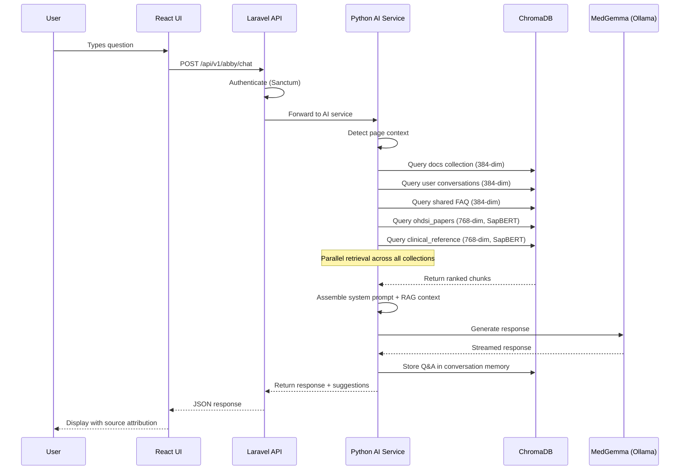

# Abby Architecture

Abby's architecture spans four layers: the frontend component library, the Python AI service, the ChromaDB vector database, and the Ollama language model runtime. Each layer is independently scalable and gracefully degrades if a dependency is unavailable.

## System Overview


## Component Stack

| Component | Technology | Role |
|-----------|-----------|------|
| **Frontend** | React 19, TypeScript | Chat UI, typing indicators, source attribution, feedback |
| **Backend Proxy** | Laravel 11, Sanctum | Authentication, rate limiting, request routing |
| **AI Service** | Python 3.12, FastAPI | RAG pipeline, embedding, prompt construction, chat orchestration |
| **Vector Store** | ChromaDB | Embedding storage, semantic search, collection management |
| **Embeddings** | sentence-transformers + SapBERT | Dual-model embedding for general and clinical content |
| **Language Model** | MedGemma 1.5 (4B) via Ollama | Response generation grounded in retrieved context |
| **Acceleration** | Apache Solr | Pre-computed 3D projections for the vector explorer |
| **Cache** | Redis | Conversation state, embedding cache |

## Request Flow

When a user asks Abby a question, the following sequence executes:



## Docker Services

Abby's backend is composed of four Docker services defined in the project's `docker-compose.yml`:

```yaml
# AI Service (FastAPI)
python-ai:
  build: docker/python/Dockerfile
  ports: ["8002:8000"]
  volumes:
    - ./ai:/app
    - ./docs:/app/docs:ro
    - ./OHDSI-scraper/ohdsi_corpus:/app/ohdsi_corpus:ro
    - ./OHDSI-scraper/book_of_ohdsi:/app/book_of_ohdsi:ro
    - ./OHDSI-scraper/hades_vignettes:/app/hades_vignettes:ro
    - ./OHDSI-scraper/ohdsi_forums:/app/ohdsi_forums:ro

# ChromaDB
chromadb:
  image: chromadb/chroma:latest
  environment:
    - IS_PERSISTENT=TRUE
  volumes:
    - chromadb-data:/chroma/chroma

# Ollama (external, host-mounted)
# Accessed via OLLAMA_BASE_URL=http://host.docker.internal:11434
```

## Embedding Models

Abby uses two embedding models, each optimized for a different type of content:

### General Embedder: sentence-transformers (384-dim)

- **Model**: `all-MiniLM-L6-v2`
- **Used by**: `docs`, `conversations_user_*`, `faq_shared`
- **Strengths**: Fast inference, excellent for matching natural language questions to documentation text
- **Index**: HNSW with cosine similarity

### Clinical Embedder: SapBERT (768-dim)

- **Model**: `cambridgeltl/SapBERT-from-PubMedBERT-fulltext`
- **Used by**: `clinical_reference`, `ohdsi_papers`
- **Strengths**: Understands clinical synonymy (MI = myocardial infarction), abbreviations, and UMLS hierarchical relationships
- **Pre-training**: Fine-tuned on PubMedBERT with UMLS concept pairs

:::info Why two models?
Clinical terminology has unique properties — abbreviations, synonymy, and hierarchical relationships — that general-purpose embedders miss. SapBERT captures that "ibuprofen IS-A NSAID" and "heart attack = acute myocardial infarction" are semantically equivalent, which is critical for research literature retrieval.
:::

## Graceful Degradation

Each component degrades independently:

| Failure | Impact | Fallback |
|---------|--------|----------|
| ChromaDB down | No RAG context | MedGemma generates from training data only |
| Ollama down | No response generation | Error message with suggestion to check AI service |
| Solr down | No 3D vector map | Live PCA+UMAP computed on-demand (~8-10s) |
| SapBERT model unavailable | No clinical embeddings | Clinical collections skipped in retrieval |
| Redis down | No conversation cache | Stateless responses (no memory persistence) |

The health dashboard at **Admin > System > Health** monitors all components and displays yellow/red status indicators when degradation occurs.
