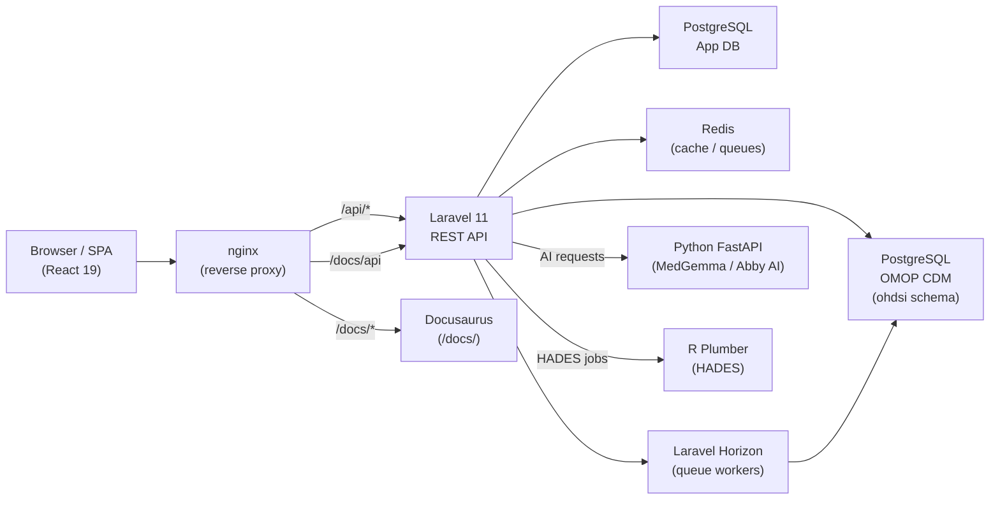
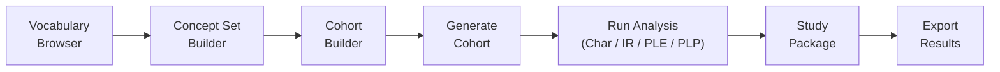

# Parthenon User Manual

Welcome to **Parthenon** — a next-generation unified outcomes research platform built on the [OMOP Common Data Model v5.4](https://ohdsi.github.io/CommonDataModel/). Parthenon replaces legacy OHDSI Atlas with a modern, fast, and extensible interface while remaining fully compatible with the OHDSI analytical toolchain.

## What is Parthenon?

Parthenon provides a single interface for the entire real-world evidence (RWE) research lifecycle: from vocabulary browsing and cohort construction through characterization, incidence estimation, causal inference, and patient-level prediction. It integrates with standardized OMOP CDM databases, exposes a REST API compatible with OHDSI WebAPI, and ships with an AI-assisted analysis layer powered by MedGemma.

## Manual Structure

| Part | Chapters | Topic |
|------|----------|-------|
| I | 1–2 | Getting started, data sources |
| II | 3–4 | Vocabulary browser, concept sets |
| III | 5–8 | Cohort building and management |
| IV | 9–14 | All analysis types |
| V | 15–17 | Data ingestion and mapping |
| VI | 18–20 | Data Explorer, Achilles, DQD |
| VII | 21 | Patient timelines |
| VIII | 22–26 | Administration |
| Appendices | A–G | Reference material |

## Platform Architecture

## Research Workflow

## Quick Links

- [Introduction →](part1-getting-started/01-introduction)
- [Building your first cohort →](part3-cohorts/06-building-cohorts)
- [API Reference →](/docs/api)
- [Keyboard shortcuts →](appendices/a-keyboard-shortcuts)
- [Glossary →](appendices/e-glossary)
