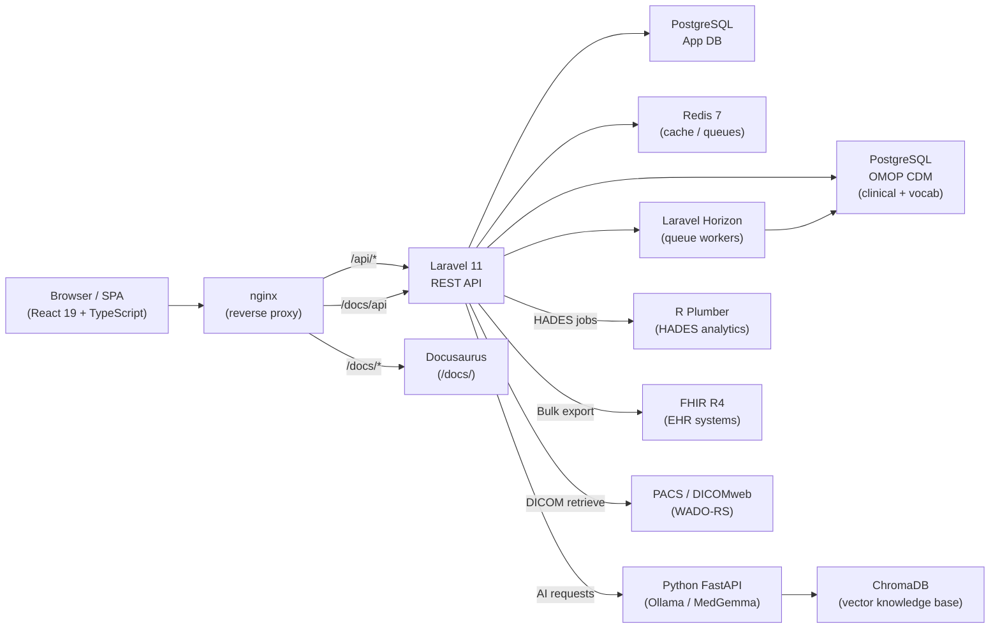
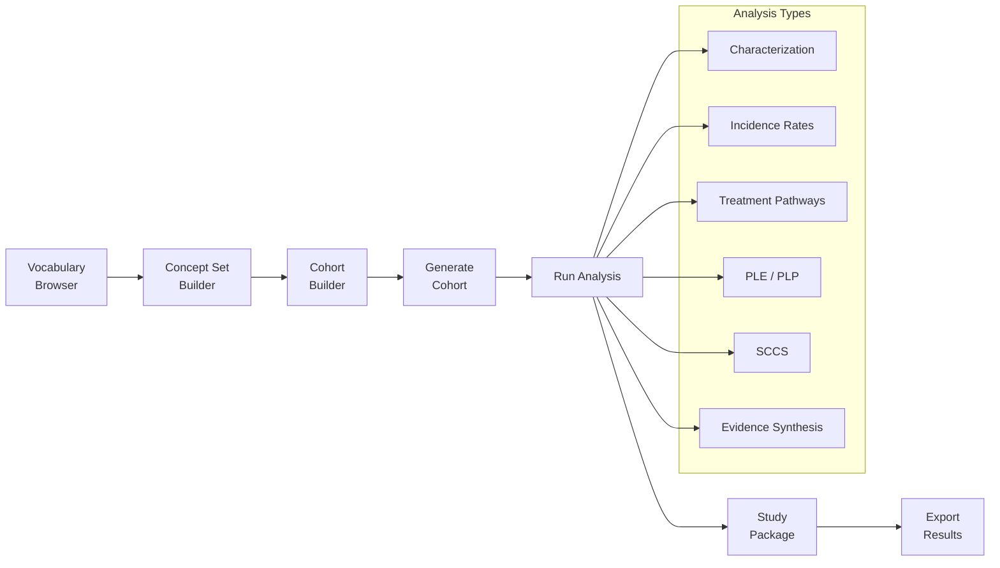

# Parthenon User Manual

Welcome to **Parthenon** — a next-generation unified outcomes research platform built on the [OMOP Common Data Model v5.4](https://ohdsi.github.io/CommonDataModel/). Parthenon replaces legacy OHDSI Atlas with a modern, performant, and extensible interface while remaining fully compatible with the OHDSI analytical toolchain including HADES, CohortGenerator, and Circe.

## What is Parthenon?

Parthenon provides a single browser-based interface for the entire real-world evidence (RWE) research lifecycle. Starting from vocabulary exploration and concept set construction, researchers build patient cohorts using a visual builder, then run a full spectrum of analyses — characterization, incidence rates, treatment pathways, population-level estimation, patient-level prediction, self-controlled case series, and evidence synthesis — all without leaving the platform.

Beyond traditional OHDSI analytics, Parthenon extends into domains that Atlas never reached:

- **Genomics** — Upload VCF files, annotate variants against ClinVar, browse mutations in an interactive variant browser, and convene virtual tumor boards with AI-assisted interpretation.
- **Medical Imaging** — View DICOM studies with a built-in Cornerstone3D viewer, connect to PACS systems via WADO-RS, and incorporate imaging criteria into cohort definitions.
- **Health Economics & Outcomes Research (HEOR)** — Model cost-effectiveness, identify care gaps across populations, and run population-level economic analytics.
- **FHIR R4 Integration** — Connect to EHR systems using SMART Backend Services for automated bulk export and incremental sync of clinical data into your OMOP CDM.
- **AI-Assisted Analysis** — An integrated AI service powered by Ollama and MedGemma provides semantic concept search, natural-language cohort suggestions, clinical result interpretation, and genomic variant summarization.

Parthenon exposes a REST API compatible with OHDSI WebAPI, so existing tools, phenotype libraries, and study packages continue to work without modification.

## Manual Structure

| Part | Chapters | Topic |
|------|----------|-------|
| [I — Getting Started](part1-getting-started/01-introduction) | 1--2 | Platform introduction, architecture, data sources |
| [II — Vocabulary](part2-vocabulary/03-vocabulary-browser) | 3--4 | Vocabulary browser, concept sets |
| [III — Cohorts](part3-cohorts/05-cohort-expressions) | 5--8 | Cohort expressions, building, generating, and management |
| [IV — Analyses](part4-analyses/09-characterization) | 9--14 | All seven analysis types and study packages |
| [V — Data Ingestion](part5-ingestion/15-uploading-data) | 15--17 | Uploading data, schema mapping, concept mapping |
| [VI — Data Explorer](part6-data-explorer/18-characterization-achilles) | 18--20 | Achilles characterization, data quality, population stats |
| [VII — Patient Profiles](part7-patient-profiles/21-patient-timelines) | 21 | Individual patient timelines |
| [VIII — Administration](part8-administration/22-user-management) | 22--26 | Users, roles, auth providers, system configuration, audit |
| [Migration Guide](migration) | -- | Migrating from Atlas to Parthenon |
| [Appendices](appendices/a-keyboard-shortcuts) | A--G | Reference material |

## Platform Architecture

Parthenon is a containerized multi-service application orchestrated with Docker Compose. Each service is purpose-built and independently scalable.

### Service Summary

| Service | Technology | Purpose |
|---------|-----------|---------|
| **Frontend** | React 19, TypeScript, Vite 7, TailwindCSS v4 | Single-page application with dark crimson and gold theme |
| **Backend API** | Laravel 11, PHP 8.4, Sanctum | RESTful API, authentication, authorization, job dispatch |
| **Queue Worker** | Laravel Horizon, Redis 7 | Background jobs: cohort generation, Achilles, bulk import |
| **AI Service** | Python FastAPI, Ollama, MedGemma | Semantic search, NLP cohort suggestions, variant interpretation |
| **R Runtime** | R Plumber, HADES packages | Statistical analyses via JDBC to OMOP CDM |
| **Database (App)** | PostgreSQL 16 | Application metadata: users, sources, cohort definitions |
| **Database (CDM)** | PostgreSQL 17 | OMOP CDM clinical data, vocabularies, Achilles results |
| **Cache** | Redis 7 | Session storage, query cache, queue broker |

## Platform Modules

Parthenon organizes functionality into the following modules:

### Clinical Research

- **Data Sources** — Configure connections to one or more OMOP CDM databases with per-schema daimons.
- **Vocabulary** — Search 7.2M+ OMOP concepts with text and AI-powered semantic search; compare concepts side-by-side.
- **Concept Sets** — Build reusable concept lists with descendant, mapped, and exclusion flags.
- **Cohort Builder** — Visually define cohorts using inclusion criteria, censoring events, and temporal logic.
- **Analyses** — Seven analysis types: Characterization, Incidence Rates, Treatment Pathways, Population-Level Estimation (PLE), Patient-Level Prediction (PLP), Self-Controlled Case Series (SCCS), and Evidence Synthesis.
- **Studies** — Package multiple analyses into reproducible study definitions for multi-site execution.
- **Patient Profiles** — Drill into individual patient timelines with domain-specific event visualization.

### Data Management

- **Data Explorer** — Achilles-powered characterization dashboards, data quality checks (DQD), and population statistics.
- **Data Ingestion** — Upload CSV/TSV files, map schemas to OMOP CDM tables, and map source codes to standard concepts.
- **Vocabulary Management** — Upload Athena vocabulary ZIP bundles to refresh concept tables (admin).

### Advanced Modules

- **Genomics** — Upload VCF files, annotate against ClinVar, browse variants with an interactive variant browser, and run virtual tumor boards with AI-assisted interpretation.
- **Imaging** — View DICOM studies inline with Cornerstone3D, connect to PACS via WADO-RS/DICOMweb, and use imaging criteria in cohort definitions.
- **HEOR** — Health economics modeling, cost-effectiveness analysis, care gap identification, and population-level economic analytics.

### Integration & Administration

- **FHIR R4** — SMART Backend Services for automated bulk data export and incremental sync from EHR systems.
- **Jobs** — Monitor background tasks: cohort generation, Achilles runs, bulk imports, FHIR syncs.
- **Administration** — User management, role and permission assignment, authentication providers (SAML 2.0, OIDC), AI provider configuration, system health monitoring, FHIR connection management, and sync dashboard.

## Research Workflow

The typical research workflow in Parthenon follows a structured pipeline from vocabulary exploration to publishable results:

:::tip New to OMOP?
If you are new to the OMOP Common Data Model, start with the [Vocabulary Browser](part2-vocabulary/03-vocabulary-browser) chapter to understand how clinical concepts are organized. The vocabulary is the foundation of every cohort definition and analysis in Parthenon.
:::

## Quick Links

- [Introduction and Architecture](part1-getting-started/01-introduction)
- [Configuring Data Sources](part1-getting-started/02-data-sources)
- [Building Your First Cohort](part3-cohorts/06-building-cohorts)
- [Running Analyses](part4-analyses/09-characterization)
- [API Reference](/docs/api)
- [Keyboard Shortcuts](appendices/a-keyboard-shortcuts)
- [Glossary](appendices/e-glossary)
- [Migrating from Atlas](migration)
- [Troubleshooting](appendices/g-troubleshooting)
