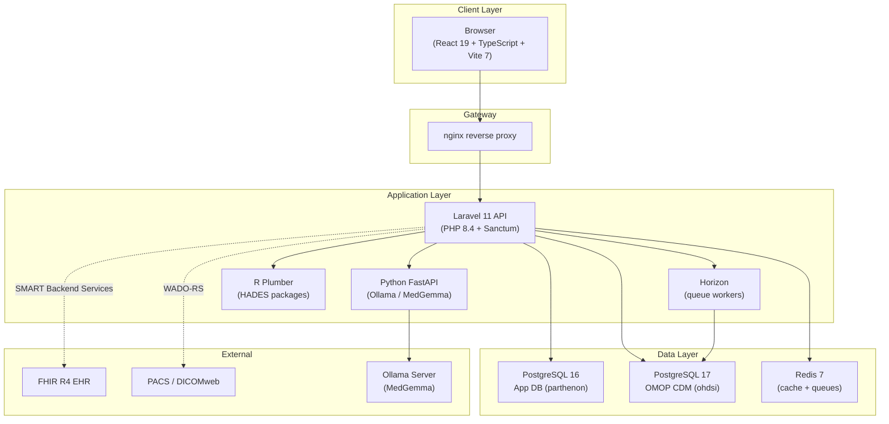

# Introduction to Parthenon

Parthenon is a unified outcomes research platform that modernizes and extends the OHDSI analytics workflow. It provides a React-based single-page application backed by a Laravel REST API, connecting to one or more OMOP CDM v5.4 databases to enable the full spectrum of real-world evidence (RWE) research — from vocabulary exploration and cohort construction through advanced statistical analyses, genomics, imaging, and health economics — all without leaving the browser.

## Why Parthenon?

Legacy OHDSI Atlas is built on Knockout.js (circa 2013) and requires a Java-based WebAPI backend with complex deployment dependencies including Flyway migrations, Tomcat, and manual CDM configuration. Parthenon replaces this entire stack with a modern, containerized architecture while maintaining full backward compatibility with the OHDSI ecosystem.

### Key Advantages Over Atlas

| Area | Atlas | Parthenon |
|------|-------|-----------|
| **Frontend** | Knockout.js, jQuery | React 19 + TypeScript, TailwindCSS v4 |
| **Backend** | Java Spring Boot, WebAPI | Laravel 11 (PHP 8.4), Sanctum auth |
| **Authentication** | BasicAuth or AD only | Sanctum sessions, SAML 2.0, OIDC, SSO |
| **Authorization** | Flat permission model | Hierarchical RBAC (Spatie) with 4 roles |
| **AI Integration** | None | MedGemma semantic search, NLP cohort suggestions |
| **Genomics** | None | VCF upload, ClinVar annotation, variant browser, tumor boards |
| **Imaging** | None | DICOM viewer (Cornerstone3D), WADO-RS/DICOMweb |
| **HEOR** | None | Cost-effectiveness modeling, care gaps, population economics |
| **EHR Integration** | None | FHIR R4 bulk export, SMART Backend Services |
| **Deployment** | Manual WAR/JAR | Docker Compose (single command) |
| **Analysis Types** | 5 | 7 (adds SCCS, Evidence Synthesis) |
| **WebAPI Compat** | N/A | Full — HADES, Atlas exports, phenotype libraries work |

## Architecture Overview

Parthenon runs as a set of Docker containers orchestrated by Docker Compose. Each service has a clearly defined responsibility:

### Frontend — React 19 + TypeScript

The frontend is a single-page application built with React 19, TypeScript, and Vite 7. It uses TailwindCSS v4 for styling with a dark crimson and gold design theme, Zustand for state management, and TanStack Query for server-state synchronization. The UI is fully responsive and designed for large-screen research workstations as well as standard monitors.

### Backend API — Laravel 11

The REST API is built on Laravel 11 (PHP 8.4) and handles authentication, authorization, CRUD operations, job dispatch, and orchestration of downstream services. It uses Laravel Sanctum for stateful SPA authentication with CSRF protection. Database queries against the OMOP CDM use dedicated read-only model classes to prevent accidental writes to clinical data.

### Queue Workers — Laravel Horizon

Long-running operations — cohort generation, Achilles analysis, bulk FHIR imports, VCF annotation — are dispatched as background jobs processed by Laravel Horizon workers backed by Redis. Job status is tracked in the Jobs module and surfaced in the UI with real-time progress indicators.

### AI Service — Python FastAPI

A Python FastAPI microservice connects to a local Ollama instance running the MedGemma model (or other configurable providers). It powers:

- **Semantic concept search** — find concepts by clinical meaning, not just keyword matching
- **Natural-language cohort suggestions** — describe a patient population in English and get structured criteria
- **Result interpretation** — AI-generated summaries of characterization and analysis outputs
- **Genomic variant annotation** — clinical significance summarization for identified variants

:::info AI Provider Configuration
Administrators can configure up to 8 AI providers (Ollama, OpenAI, Anthropic, Google, Azure, and others) from the **Admin > AI Providers** panel. Only one provider is active at a time. Ollama with MedGemma is the default for on-premises deployments with no data leaving your network.
:::

### R Runtime — Plumber API

An R Plumber service wraps OHDSI HADES packages (CohortGenerator, FeatureExtraction, CohortMethod, PatientLevelPrediction, SelfControlledCaseSeries, EvidenceSynthesis) and connects to the OMOP CDM via JDBC. The Laravel backend dispatches analysis jobs to this service when R-based statistical methods are required.

### Databases

Parthenon uses two separate PostgreSQL databases:

- **App DB (PostgreSQL 16)** — Stores application metadata: users, roles, sessions, source configurations, cohort definitions, concept sets, analysis settings, and job records. This database is managed by Laravel migrations.
- **CDM DB (PostgreSQL 17)** — Contains the OMOP CDM clinical data, vocabulary tables, and Achilles results. This database is read-only from Parthenon's perspective (except for results schemas where cohort tables and Achilles outputs are written).

:::warning Two Databases, Not One
A common misconception is that Parthenon stores everything in a single database. The application database and the CDM database are separate PostgreSQL instances. Resetting the app database (e.g., `migrate:fresh`) does not affect clinical data, but it does destroy all source configurations, cohort definitions, and user accounts. Always back up before resetting.
:::

## Authentication

Parthenon supports multiple authentication mechanisms:

### Sanctum Session Authentication (Default)
The built-in authentication uses Laravel Sanctum with cookie-based sessions and CSRF protection. Users register with an email address and receive a temporary password that must be changed on first login.

### SAML 2.0
For enterprise single sign-on, Parthenon supports SAML 2.0 identity providers (Azure AD, Okta, OneLogin, ADFS, etc.). Configure your IdP metadata URL and attribute mappings in **Admin > Authentication Providers**.

### OpenID Connect (OIDC)
OIDC providers (Keycloak, Auth0, Google Workspace, etc.) can be configured for federated authentication. Parthenon handles the authorization code flow and maps OIDC claims to local user roles.

:::tip First-Time Login
When a new user account is created (either by an admin or via self-registration), a temporary password is emailed to the user. On first login, a blocking modal requires the user to set a new password before accessing any platform features.
:::

## User Roles and Permissions

Parthenon uses a hierarchical role-based access control system powered by Spatie Laravel Permission. Four built-in roles provide progressively broader access:

| Role | Description | Key Capabilities |
|------|-------------|------------------|
| **super-admin** | Full platform control | All permissions, system configuration, AI provider settings, auth provider management, vocabulary uploads |
| **admin** | Organizational management | User management, data source configuration, role assignment, FHIR connection setup |
| **researcher** | Clinical research | Create/edit cohorts, concept sets, and analyses; run analyses; access patient profiles; upload VCF/DICOM files |
| **viewer** | Read-only access | Browse vocabularies, view cohort definitions and results, export data; cannot create or modify |

Your current role is displayed in the user menu (top right corner). Contact your administrator to request elevated access.

### Permission Granularity

Beyond roles, individual permissions can be assigned for fine-grained control:

- `view patients` — Required to access Patient Profiles (PHI-sensitive)
- `manage sources` — Required to add, edit, or delete data source configurations
- `manage users` — Required to create accounts and assign roles
- `run analyses` — Required to execute (not just view) analyses
- `upload genomics` — Required to upload VCF files
- `view imaging` — Required to access the DICOM viewer

## System Requirements

### For End Users

- A modern browser: Chrome 120+, Firefox 120+, Safari 17+, or Edge 120+
- Network access to the Parthenon server URL
- A user account with an appropriate role

### For Administrators

- Docker Engine 24+ and Docker Compose v2
- At least 8 GB RAM for the full service stack (16 GB recommended)
- PostgreSQL 16+ for the app database
- PostgreSQL with OMOP CDM v5.4 tables populated (or use the included Eunomia demo dataset)
- Optional: Ollama with MedGemma for AI features; PACS server for imaging; FHIR-enabled EHR for integration

## Logging In

1. Navigate to the Parthenon URL provided by your administrator (e.g., `https://parthenon.yourorg.net`).
2. Enter your email address and password.
3. Click **Sign In**.
4. On first login, you will be prompted to change your temporary password via a blocking modal.

:::tip First-Time Setup for Super-Admins
After the initial deployment, the first super-admin user is created by the installer or via `php artisan admin:seed`. On first login, the platform presents a **Setup Wizard** — a six-step guided configuration covering system health verification, AI provider setup, authentication configuration, and data source registration. Regular users see a simpler onboarding tour instead.
:::

## Main Navigation

The top navigation bar provides access to all platform modules. Available items depend on your role and permissions.

| Menu Item | Module | Role Required |
|-----------|--------|---------------|
| **Data Sources** | Browse and configure OMOP CDM connections | viewer+ |
| **Vocabulary** | Search concepts, build concept sets | viewer+ |
| **Cohorts** | Define, generate, and manage patient cohorts | researcher+ |
| **Analyses** | Run all seven analysis types | researcher+ |
| **Studies** | Package analyses into reproducible study definitions | researcher+ |
| **Data Explorer** | Achilles dashboards, data quality, population stats | viewer+ |
| **Patients** | Individual patient timelines | researcher+ with `view patients` |
| **Data Ingestion** | Upload and map source data to OMOP CDM | admin+ |
| **Genomics** | VCF upload, variant browser, tumor boards | researcher+ with `upload genomics` |
| **Imaging** | DICOM viewer, PACS connections | researcher+ with `view imaging` |
| **HEOR** | Health economics, care gaps, population analytics | researcher+ |
| **Jobs** | Monitor background tasks | viewer+ |
| **Admin** | Users, roles, auth, AI, system health, vocabulary, FHIR, sync | admin+ |

## Complete Feature Set

### Vocabulary and Concept Management
- Full-text and AI-powered semantic concept search across 7.2M+ OMOP concepts
- Concept detail view with hierarchy navigation (ancestors, descendants, relationships)
- Concept comparison tool for side-by-side evaluation
- Reusable concept sets with descendant, mapped, and exclusion flags
- OHDSI-compatible JSON import/export for concept sets
- Admin vocabulary management: upload Athena ZIP bundles to refresh concept tables

### Cohort Building and Management
- Visual cohort expression builder with inclusion/exclusion criteria
- Temporal logic (time-windowed events, sequential criteria)
- Nested criteria groups with AND/OR logic
- Concept set integration with live resolution preview
- Cohort generation against any configured data source
- Generation history with record counts and execution times
- Cohort comparison and overlap analysis
- Import/export cohort definitions as OHDSI-compatible JSON

### Analyses (7 Types)
- **Characterization** — Baseline feature extraction for one or more cohorts
- **Incidence Rates** — Calculate incidence of outcomes in target populations
- **Treatment Pathways** — Visualize sequences of treatments (sunburst diagrams)
- **Population-Level Estimation (PLE)** — Causal inference using propensity scores
- **Patient-Level Prediction (PLP)** — Build and validate predictive models
- **Self-Controlled Case Series (SCCS)** — Within-person study designs
- **Evidence Synthesis** — Meta-analysis across multiple databases or analyses

### Data Explorer
- Achilles-powered CDM characterization: demographics, conditions, drugs, measurements
- Data quality dashboard (DQD) with heel checks and domain-level quality indicators
- Population statistics with trend visualization
- Multi-source comparison with source selector dropdown

### Genomics
- VCF file upload with automatic parsing and storage
- ClinVar annotation for clinical significance assessment
- Interactive variant browser with filtering by gene, consequence, and significance
- Virtual tumor board interface with AI-assisted variant interpretation
- Genomic criteria integration into cohort definitions

### Medical Imaging
- Built-in DICOM viewer powered by Cornerstone3D
- PACS connectivity via WADO-RS / DICOMweb
- Study and series browsing with metadata display
- Imaging criteria available in the cohort builder

### Health Economics & Outcomes Research (HEOR)
- Cost-effectiveness modeling and analysis
- Care gap identification across patient populations
- Population-level economic analytics with configurable metrics
- Integration with cohort-based analyses for targeted economic evaluation

### EHR Integration
- FHIR R4 connectivity using SMART Backend Services
- Bulk data export from FHIR-enabled EHR systems
- Incremental sync for keeping CDM data current
- Connection management and sync dashboard in Administration

### Administration
- User management: create, edit, deactivate accounts
- Role and permission assignment with hierarchical RBAC
- Authentication provider configuration (local, SAML 2.0, OIDC)
- AI provider configuration (8 supported providers, encrypted credentials)
- System health dashboard with auto-refresh monitoring of all services
- Vocabulary management: upload Athena vocabulary bundles
- FHIR connection management and sync dashboard
- Audit logging of security-relevant actions

## Getting Help

- **In-App Help** — Click the help icon in the top navigation for contextual documentation and guided tours.
- **User Manual** — You are reading it. Use the sidebar to navigate to specific chapters.
- **API Reference** — Available at [`/docs/api`](/docs/api) with full endpoint documentation generated from the codebase.
- **Keyboard Shortcuts** — See [Appendix A](../appendices/a-keyboard-shortcuts) for a complete list.
- **Troubleshooting** — See [Appendix G](../appendices/g-troubleshooting) for common issues and solutions.

## Next Steps

Now that you understand the platform architecture and capabilities, proceed to [Chapter 2: Data Sources](./02-data-sources) to learn how to configure connections to your OMOP CDM databases — the foundation for all research activities in Parthenon.
