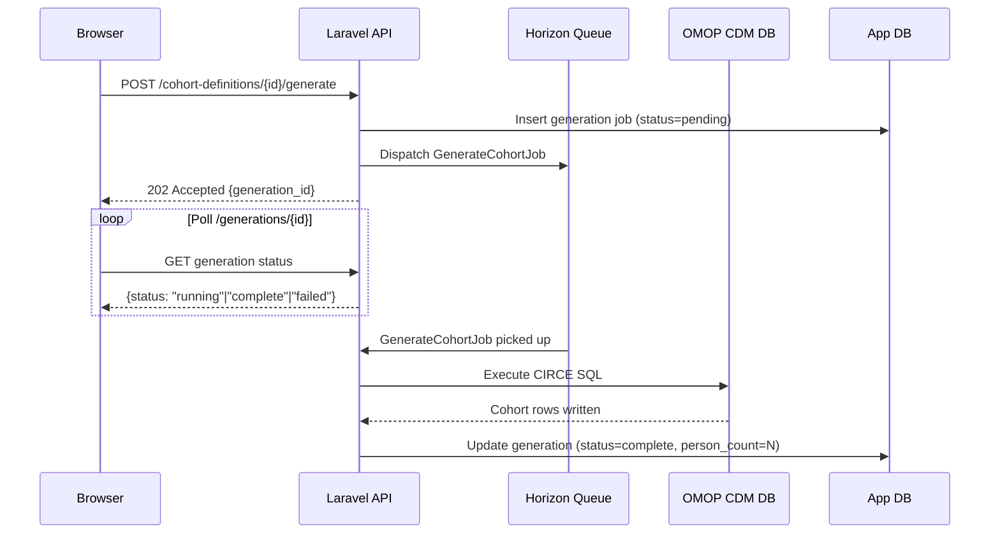

# Generating Cohorts

**Cohort generation** is the process of executing a cohort definition against a live OMOP CDM database to produce a list of patient-entry-date pairs stored in the `cohort` table. Only after generation can you run analyses that reference that cohort.

## Starting Generation

1. Open the cohort definition you want to generate.
2. Click **Generate** (top right of the cohort detail page).
3. Select one or more **Data Sources** to generate against. Each source produces an independent generation result.
4. Click **Start Generation**.

Parthenon submits the generation job to the background queue (Laravel Horizon). The generation task:

1. Compiles the CIRCE JSON expression into SQL using the CIRCE-BE library
2. Executes the SQL against the CDM database via the configured source connection
3. Writes results into the results schema `cohort` table with `cohort_definition_id` matching your definition
4. Records the generation job status in the application database



## Monitoring Progress

The **Generations** tab on the cohort detail page shows all generation jobs for the definition:

| Column | Description |
|--------|-------------|
| Source | Data source name |
| Status | Pending / Running / Complete / Failed |
| Started | Timestamp generation began |
| Count | Number of cohort entries (patients × entries) |
| Persons | Unique person count |
| Duration | Elapsed time |

Generation typically takes seconds to minutes depending on CDM size. For very large databases (100M+ patients), complex cohorts may take 15–30 minutes.

## Attrition Report

After a successful generation, click **Attrition** to view the waterfall report. This shows:

- Number of qualifying events before any inclusion rules
- Cumulative count after each successive inclusion rule
- Final cohort count

The attrition report is essential for verifying that your cohort logic behaves as expected. Large drops at unexpected rules often indicate logic errors in time windows or concept set selection.

## Failed Generations

If a generation fails, click **View Error** to see the underlying SQL error message. Common causes:

- **Schema not found** — the daimon schema does not exist in the database
- **Concept set empty** — a referenced concept set resolved to zero concept IDs against this vocabulary
- **SQL timeout** — complex queries on very large databases may exceed the configured timeout
- **Permissions error** — the database user lacks SELECT on CDM tables or INSERT on the results schema

:::note Regeneration
Regenerating a cohort overwrites any previous generation result for that source. All analyses that previously referenced the generation will need to be re-run to reflect the new counts.
:::

## Cohort Table Structure

Generated cohorts are stored in the `{results_schema}.cohort` table:

```sql
cohort_definition_id  BIGINT
subject_id            BIGINT   -- person_id
cohort_start_date     DATE
cohort_end_date       DATE
```

Each row represents one cohort entry. A single `subject_id` may appear multiple times if the definition allows multiple entries per person.
