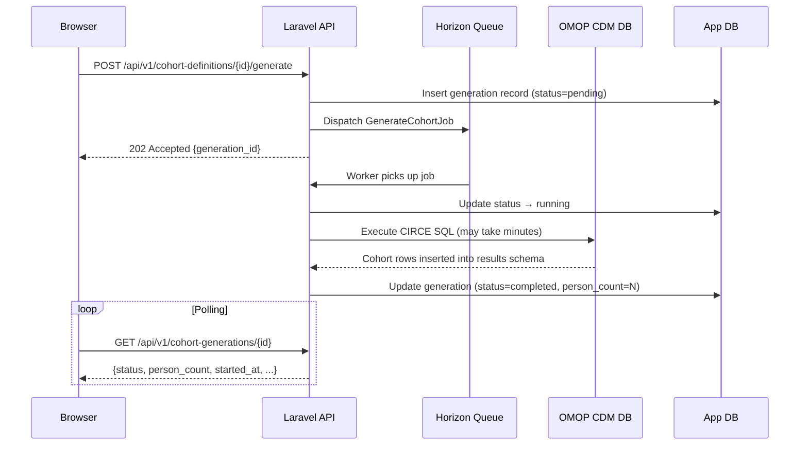

# Generating Cohorts

**Cohort generation** is the process of executing a cohort definition against a live OMOP CDM database to produce a concrete set of patient-entry-date pairs stored in the results schema `cohort` table. Until a cohort is generated, the definition is just a specification --- no patient data exists. Generation transforms the CIRCE JSON into SQL, executes it, and records the results.

---

## Starting a Generation

1. Open the cohort definition you want to generate.
2. Click **Generate** (top-right of the cohort detail page).
3. Select one or more **Data Sources** to generate against. Each source produces an independent generation result with its own person count and attrition report.
4. Click **Start Generation**.

Parthenon immediately returns control to the UI while the generation runs asynchronously in the background.

:::info Multi-source generation
Selecting multiple data sources queues one generation job per source. This is the standard pattern for OHDSI network studies --- the same cohort definition is run against each participating database to compare phenotype performance across data sources.
:::

---

## Background Queue Execution

Cohort generation is powered by **Laravel Horizon**, a Redis-backed job queue system. This architecture ensures that long-running SQL queries do not block the web server or timeout in the browser.

The generation lifecycle:



### What Happens During Generation

1. **CIRCE compilation**: The JSON expression is compiled into parameterized SQL targeting the source's CDM schema.
2. **Schema resolution**: The source's daimon configuration determines which schema holds CDM tables, vocabulary tables, and where to write results.
3. **SQL execution**: The compiled SQL runs against the CDM database. For large databases (100M+ patients), complex cohorts may take 15--30 minutes.
4. **Results storage**: Matching patient records are written to the `{results_schema}.cohort` table with the `cohort_definition_id` as a foreign key.
5. **Attrition recording**: The count of patients surviving each inclusion rule is recorded for the attrition report.
6. **Status update**: The generation record in the app database is updated with final status, person count, and timestamps.

---

## Monitoring Generation Progress

The **Generations** section on the cohort detail page shows all generation jobs for the definition:

| Column | Description |
|---|---|
| **Source** | Data source name |
| **Status** | `pending` / `queued` / `running` / `completed` / `failed` / `cancelled` |
| **Started** | Timestamp when the worker picked up the job |
| **Count** | Total cohort entries (patients x entries, may exceed unique persons if multiple entries allowed) |
| **Persons** | Unique person count |
| **Duration** | Elapsed wall-clock time |

The UI polls the generation status automatically. You do not need to refresh the page.

### Expected Generation Times

| CDM Size | Simple cohort | Complex cohort (5+ rules) |
|---|---|---|
| < 100K patients (Eunomia) | < 5 seconds | < 15 seconds |
| 1M patients | 10--30 seconds | 1--5 minutes |
| 10M patients | 1--3 minutes | 5--15 minutes |
| 100M+ patients | 5--15 minutes | 15--60 minutes |

Times depend heavily on the number of inclusion rules, the number of concept sets referenced, and database hardware. Indexes on CDM tables (especially `person_id` and `*_concept_id` columns) significantly impact performance.

---

## Attrition Report

After a successful generation, click **Attrition** to view the waterfall report. The attrition report is one of the most important quality checks in cohort development.

The report shows:

| Step | Description |
|---|---|
| **Initial events** | Total qualifying events before any inclusion rules |
| **After Rule 1** | Count surviving the first named inclusion rule |
| **After Rule 2** | Count surviving the first two rules (cumulative) |
| ... | Each subsequent rule |
| **Final cohort** | Final count after all rules applied |

Each row includes:
- Absolute count of surviving patients
- Percentage relative to the initial event count
- Incremental drop from the previous rule

### Reading the Attrition Report

The attrition report reveals:

- **Expected drops**: Washout rules (no prior exposure) and observation window requirements typically cause the largest drops.
- **Unexpected drops**: If a rule you expect to be lenient drops 80% of patients, investigate whether the concept set is too narrow or the time window is too tight.
- **Zero final count**: If no patients survive all rules, relax the most restrictive criteria or check concept set resolution against the vocabulary.
- **Inclusion rule ordering**: Rules are applied sequentially, so the order affects which rule appears to cause attrition. Reorder rules to isolate the impact of specific criteria.

:::tip Validate with known counts
Before using a cohort in a study, compare the generated count against expectations from published prevalence data or prior studies on similar databases. A T2DM cohort on a 1M-patient claims database should yield roughly 80,000--120,000 patients (8--12% prevalence). Major deviations warrant investigation.
:::

---

## Failed Generations

If a generation fails, the status changes to `failed` and an error message is recorded. Click **View Error** to see the underlying cause. Common failure scenarios:

| Error | Cause | Fix |
|---|---|---|
| Schema not found | Daimon `table_qualifier` points to a nonexistent schema | Check source configuration in Admin > Data Sources |
| Relation does not exist | CDM table missing from the schema | Verify the CDM tables exist in the configured schema |
| Concept set resolves to 0 concepts | Referenced concept set has no valid concept IDs in this vocabulary | Check vocabulary version; rebuild concept set |
| SQL timeout | Query exceeded configured timeout | Increase `statement_timeout` on the CDM database or simplify the cohort |
| Permission denied | Database user lacks SELECT on CDM tables or INSERT on results schema | Grant appropriate permissions to the database user |
| Horizon worker not running | No worker is processing the queue | Check `php artisan horizon:status`; restart with `php artisan horizon` |

:::warning Queue health
If generations stay in `pending` status indefinitely, the Horizon queue worker may be down. Check the system health dashboard at **Admin > System Health** or run `php artisan horizon:status` from the CLI.
:::

---

## Regeneration

You can regenerate a cohort at any time by clicking **Generate** again on the same source:

- The previous generation result for that source is **overwritten** with the new result.
- The `cohort` table rows for the old generation are deleted and replaced.
- All downstream analyses that referenced the old generation are now stale and should be re-executed to reflect the updated cohort.

Regeneration is commonly needed after:
- Modifying the cohort definition (adding/changing inclusion rules)
- CDM data refresh (new data loaded into the database)
- Vocabulary update (concept set resolution may change)
- Bug fix in concept set construction

---

## Cohort Table Structure

Generated cohorts are stored in the results schema `cohort` table, following the OMOP CDM convention:

```sql
CREATE TABLE {results_schema}.cohort (
    cohort_definition_id  BIGINT    NOT NULL,
    subject_id            BIGINT    NOT NULL,  -- person_id
    cohort_start_date     DATE      NOT NULL,
    cohort_end_date       DATE      NOT NULL
);
```

| Column | Description |
|---|---|
| `cohort_definition_id` | Links to the cohort definition in the app database |
| `subject_id` | The `person_id` from the CDM `person` table |
| `cohort_start_date` | The index date (start of cohort membership) |
| `cohort_end_date` | Determined by the end strategy (observation end, fixed duration, or drug era end) |

A single `subject_id` may appear multiple times if the definition allows multiple entries per person (`ExpressionLimit: "All"` with collapse disabled).

### Querying Generated Cohorts

You can query the generated cohort directly for ad-hoc analysis:

```sql
-- Count unique patients in a generated cohort
SELECT COUNT(DISTINCT subject_id) AS person_count
FROM {results_schema}.cohort
WHERE cohort_definition_id = 42;

-- Distribution of cohort membership duration
SELECT
    percentile_cont(0.25) WITHIN GROUP (ORDER BY cohort_end_date - cohort_start_date) AS p25_days,
    percentile_cont(0.50) WITHIN GROUP (ORDER BY cohort_end_date - cohort_start_date) AS median_days,
    percentile_cont(0.75) WITHIN GROUP (ORDER BY cohort_end_date - cohort_start_date) AS p75_days
FROM {results_schema}.cohort
WHERE cohort_definition_id = 42;
```

:::danger Do not modify cohort tables directly
The `cohort` table is managed by Parthenon's generation engine. Manual inserts, updates, or deletes will corrupt the generation metadata and may cause analyses to produce incorrect results. Always use the UI or API to manage cohort generations.
:::

---

## Generation via API

Cohort generation can also be triggered programmatically:

```bash
# Start generation
curl -X POST https://parthenon.example.com/api/v1/cohort-definitions/42/generate \
  -H "Authorization: Bearer $TOKEN" \
  -H "Content-Type: application/json" \
  -d '{"source_ids": [1, 2]}'

# Poll status
curl https://parthenon.example.com/api/v1/cohort-generations/123 \
  -H "Authorization: Bearer $TOKEN"
```

The API returns generation status objects matching the same structure displayed in the UI. This enables integration with CI/CD pipelines, scheduled study execution, and external orchestration tools.
