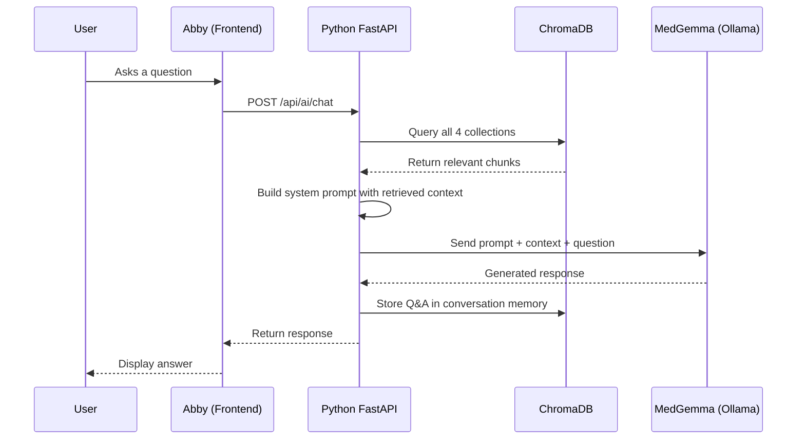

# Abby AI Assistant

**Abby** is Parthenon's built-in AI research assistant, powered by [MedGemma](https://ai.google.dev/gemma/docs/medgemma) and backed by a **ChromaDB vector knowledge base**. Abby helps researchers with concept search, cohort building suggestions, clinical result interpretation, genomic variant summarization, and general platform guidance — all within the context of the current page.

## Overview

Abby combines a large language model (MedGemma 1.5 4B via Ollama) with retrieval-augmented generation (RAG) to provide accurate, context-aware responses. Rather than relying solely on the model's training data, Abby retrieves relevant knowledge from four specialized ChromaDB collections before generating each response. This ensures answers are grounded in Parthenon's documentation, the user's conversation history, community knowledge, and clinical reference data.

:::info Air-gapped deployments
Because Abby runs entirely through Ollama and ChromaDB (both on-premises services), no data ever leaves your infrastructure. This makes Abby suitable for air-gapped healthcare environments with strict data governance requirements.
:::

## Knowledge Layers

Abby's ChromaDB brain is organized into four vector collections, each serving a distinct purpose:

### 1. Documentation

| Property | Value |
|----------|-------|
| **Collection** | `parthenon_docs` |
| **Content** | Project documentation, user manual chapters, API references |
| **Size** | 39,000+ chunks |
| **Ingestion** | Auto-ingested on AI service startup |
| **Embedding Model** | sentence-transformers |

The documentation collection is the primary knowledge source. On startup, the AI service scans all Markdown and MDX files in the project, splits them into overlapping chunks, generates embeddings, and stores them in ChromaDB. This means Abby always has up-to-date knowledge of every Parthenon feature, configuration option, and workflow.

### 2. Conversation Memory

| Property | Value |
|----------|-------|
| **Collection** | `conversation_memory` |
| **Content** | Per-user question-and-answer pairs |
| **TTL** | 90 days (auto-pruned) |
| **Embedding Model** | sentence-transformers |

Every interaction with Abby is stored as a vector embedding tied to the user's ID. When a user asks a follow-up question or revisits a topic, Abby retrieves relevant prior exchanges to maintain continuity. Conversation memory is scoped per-user — users never see each other's history. Entries older than 90 days are automatically pruned to keep the collection performant.

### 3. Shared FAQ

| Property | Value |
|----------|-------|
| **Collection** | `shared_faq` |
| **Content** | Frequently asked questions promoted from individual conversations |
| **Embedding Model** | sentence-transformers |

When multiple users ask similar questions, the system can promote those Q&A pairs into the shared FAQ collection. This creates an organization-wide knowledge base that benefits all users. FAQ promotion can be triggered manually via the management API or configured to run automatically based on frequency thresholds.

:::tip Building institutional knowledge
The shared FAQ collection grows organically as your team uses Abby. Common questions about your specific OMOP CDM configuration, local data quirks, or institutional workflows get captured and reused — reducing repetitive support requests.
:::

### 4. Clinical Reference

| Property | Value |
|----------|-------|
| **Collection** | `clinical_reference` |
| **Content** | OMOP concepts embedded with clinical semantics |
| **Embedding Model** | SapBERT (clinical domain) |

The clinical reference collection contains OMOP concept embeddings generated using **SapBERT**, a biomedical language model specifically trained on UMLS concepts. This enables Abby to understand clinical terminology at a semantic level — for example, recognizing that "heart attack" and "acute myocardial infarction" refer to the same clinical concept, even when the exact term doesn't appear in the vocabulary tables.

## How RAG Works

Retrieval-Augmented Generation (RAG) is the technique that connects Abby's knowledge base to the language model. Here is how a typical interaction flows:



1. **User asks a question** — The question is sent to the Python FastAPI AI service along with the current page context.
2. **Retrieval** — The AI service queries all four ChromaDB collections in parallel, using the question as a semantic search query. Each collection returns its most relevant chunks ranked by cosine similarity.
3. **Context assembly** — Retrieved chunks are deduplicated, ranked by relevance, and injected into the system prompt alongside the page context.
4. **Generation** — MedGemma receives the enriched prompt and generates a response grounded in the retrieved knowledge.
5. **Memory storage** — The Q&A pair is embedded and stored in the user's conversation memory for future retrieval.

## Page-Aware Context

Abby adapts her responses based on which page the user is currently viewing. The system defines **22 page contexts** that tailor Abby's behavior, expertise framing, and suggested follow-up actions:

| Page Context | Abby's Focus |
|-------------|-------------|
| Vocabulary Browser | Concept search strategies, hierarchy navigation, semantic matching |
| Concept Set Builder | Inclusion/exclusion logic, descendant flags, concept mapping |
| Cohort Builder | Cohort expression construction, criteria logic, temporal constraints |
| Cohort Generation | Generation status, error troubleshooting, performance tips |
| Characterization | Feature extraction setup, baseline characteristics, covariate selection |
| Incidence Rates | Rate calculation methodology, time-at-risk configuration |
| Treatment Pathways | Pathway analysis design, event sequencing, sunburst interpretation |
| PLE / PLP | Estimation methods, propensity scores, prediction model evaluation |
| Data Explorer | Achilles results interpretation, data quality metrics |
| Data Ingestion | Schema mapping guidance, concept mapping suggestions |
| Genomics | Variant interpretation, ClinVar annotations, tumor board summaries |
| Imaging | DICOM viewer guidance, PACS connectivity |
| HEOR | Cost-effectiveness modeling, care gap analysis |
| FHIR Integration | SMART auth configuration, bulk export troubleshooting |
| Administration | System configuration, user management, health monitoring |

When no specific page context is detected, Abby defaults to a general research assistant persona with broad platform knowledge.

## Dual Embedding Models

Abby uses two specialized embedding models to handle different types of content:

| Model | Purpose | Used By |
|-------|---------|---------|
| **sentence-transformers** | General-purpose text embeddings | Documentation, Conversation Memory, Shared FAQ |
| **SapBERT** | Biomedical / clinical concept embeddings | Clinical Reference |

**sentence-transformers** (specifically `all-MiniLM-L6-v2`) provides fast, high-quality embeddings for general text — documentation paragraphs, user questions, and FAQ entries. It runs efficiently on CPU and produces 384-dimensional vectors.

**SapBERT** (`cambridgeltl/SapBERT-from-PubMedBERT-fulltext`) is a biomedical language model pre-trained on UMLS concept relationships. It understands clinical synonymy, abbreviations, and hierarchical relationships between medical terms. This model is used exclusively for the clinical reference collection to ensure that concept searches capture semantic meaning, not just lexical overlap.

:::info Why two models?
A general-purpose embedding model excels at matching natural language questions to documentation text. However, clinical terminology has unique properties — abbreviations (MI = myocardial infarction), synonymy (heart attack = acute MI), and hierarchical relationships (ibuprofen IS-A NSAID) — that require a domain-specific model to capture accurately.
:::

## Management Endpoints

The AI service exposes five ChromaDB management endpoints for administrative use. These are accessible via the Python FastAPI service (default port 8002).

| Endpoint | Method | Description |
|----------|--------|-------------|
| `/chromadb/health` | GET | Returns ChromaDB connection status, collection counts, and total vectors stored |
| `/chromadb/ingest-docs` | POST | Triggers re-ingestion of all project documentation into the `parthenon_docs` collection |
| `/chromadb/ingest-clinical` | POST | Ingests OMOP concepts into the `clinical_reference` collection using SapBERT embeddings |
| `/chromadb/promote-faq` | POST | Promotes frequent Q&A pairs from conversation memory into the shared FAQ collection |
| `/chromadb/prune-conversations` | POST | Removes conversation memory entries older than the configured TTL (default: 90 days) |

### Usage Examples

```bash
# Check ChromaDB health
curl http://localhost:8002/chromadb/health

# Re-ingest documentation after updating docs
curl -X POST http://localhost:8002/chromadb/ingest-docs

# Ingest clinical concepts (run after vocabulary update)
curl -X POST http://localhost:8002/chromadb/ingest-clinical

# Promote frequently asked questions to shared FAQ
curl -X POST http://localhost:8002/chromadb/promote-faq

# Prune old conversation memory
curl -X POST http://localhost:8002/chromadb/prune-conversations
```

:::warning Re-ingestion timing
The `ingest-docs` and `ingest-clinical` endpoints perform full re-ingestion, which can take several minutes depending on the volume of content. Run these during maintenance windows to avoid temporary gaps in retrieval quality during the ingestion process.
:::

## System Health

ChromaDB is monitored as part of the Parthenon health dashboard at **Admin > System > Health**. The health check verifies:

- ChromaDB service is reachable
- All four collections exist and are queryable
- Total vector count is within expected range
- Embedding model endpoints are responsive

If ChromaDB is unreachable, Abby gracefully degrades to operating without RAG context — responses will still be generated by MedGemma but without the benefit of retrieved knowledge. A **yellow** status appears on the health dashboard when ChromaDB is degraded, and **red** when it is completely unreachable.

:::tip After vocabulary updates
When you update the OMOP vocabulary via **Admin > System > Vocabulary**, remember to re-ingest clinical concepts by calling the `/chromadb/ingest-clinical` endpoint. This ensures Abby's clinical reference collection reflects the latest concept additions and deprecations.
:::
