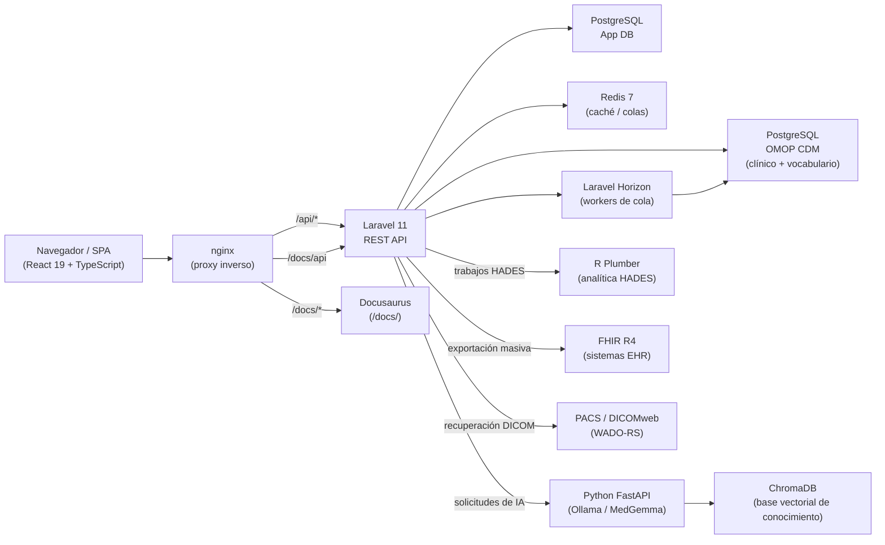
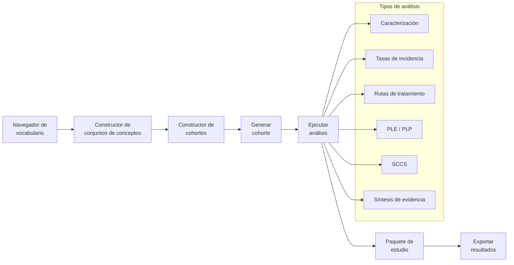

# Manual de usuario de Parthenon

Bienvenido a **Parthenon**, una plataforma unificada de investigación de desenlaces de nueva generación construida sobre el [OMOP Common Data Model v5.4](https://ohdsi.github.io/CommonDataModel/). Parthenon reemplaza el OHDSI Atlas heredado con una interfaz moderna, rápida y extensible, manteniendo compatibilidad completa con la cadena analítica de OHDSI, incluidos HADES, CohortGenerator y Circe.

## ¿Qué es Parthenon?

Parthenon proporciona una única interfaz basada en navegador para todo el ciclo de vida de investigación con evidencia del mundo real (RWE). A partir de la exploración de vocabulario y la construcción de conjuntos de conceptos, los investigadores crean cohortes de pacientes con un constructor visual y luego ejecutan un espectro completo de análisis: caracterización, tasas de incidencia, rutas de tratamiento, estimación a nivel poblacional, predicción a nivel de paciente, series de casos autocontroladas y síntesis de evidencia, todo sin salir de la plataforma.

Además de la analítica OHDSI tradicional, Parthenon se extiende a dominios que Atlas nunca cubrió:

- **Genómica**: cargue archivos VCF, anote variantes contra ClinVar, explore mutaciones en un navegador interactivo de variantes y convoque tumor boards virtuales con interpretación asistida por IA.
- **Imágenes médicas**: vea estudios DICOM con un visor Cornerstone3D integrado, conéctese a sistemas PACS mediante WADO-RS e incorpore criterios de imágenes en definiciones de cohortes.
- **Economía de la salud e investigación de desenlaces (HEOR)**: modele costo-efectividad, identifique brechas de atención en poblaciones y ejecute analítica económica a nivel poblacional.
- **Integración FHIR R4**: conéctese a sistemas EHR mediante SMART Backend Services para exportación masiva automatizada y sincronización incremental de datos clínicos hacia su OMOP CDM.
- **Análisis asistido por IA**: un servicio de IA integrado, impulsado por Ollama y MedGemma, proporciona búsqueda semántica de conceptos, sugerencias de cohortes en lenguaje natural, interpretación de resultados clínicos y resumen de variantes genómicas.

Parthenon expone una REST API compatible con OHDSI WebAPI, por lo que las herramientas existentes, bibliotecas de fenotipos y paquetes de estudio siguen funcionando sin modificaciones.

## Estructura del manual

| Parte | Capítulos | Tema |
|------|----------|------|
| [I — Primeros pasos](part1-getting-started/01-introduction) | 1--2 | Introducción a la plataforma, arquitectura, fuentes de datos |
| [II — Vocabulario](part2-vocabulary/03-vocabulary-browser) | 3--4 | Navegador de vocabulario, conjuntos de conceptos |
| [III — Cohortes](part3-cohorts/05-cohort-expressions) | 5--8 | Expresiones de cohorte, construcción, generación y gestión |
| [IV — Análisis](part4-analyses/09-characterization) | 9--14 | Los siete tipos de análisis y paquetes de estudio |
| [V — Ingesta de datos](part5-ingestion/15-uploading-data) | 15--17 | Carga de datos, mapeo de esquemas, mapeo de conceptos |
| [VI — Explorador de datos](part6-data-explorer/18-characterization-achilles) | 18--20 | Caracterización Achilles, calidad de datos, estadísticas poblacionales |
| [VII — Perfiles de pacientes](part7-patient-profiles/21-patient-timelines) | 21 | Líneas de tiempo individuales de pacientes |
| [VIII — Administración](part8-administration/22-user-management) | 22--26 | Usuarios, roles, proveedores de autenticación, configuración del sistema, auditoría |
| [Guía de migración](migration) | -- | Migración de Atlas a Parthenon |
| [Apéndices](appendices/a-keyboard-shortcuts) | A--G | Material de referencia |

## Arquitectura de la plataforma

Parthenon es una aplicación contenedorizada de múltiples servicios, orquestada con Docker Compose. Cada servicio tiene un propósito específico y puede escalarse de forma independiente.

### Resumen de servicios

| Servicio | Tecnología | Propósito |
|---------|------------|-----------|
| **Frontend** | React 19, TypeScript, Vite 7, TailwindCSS v4 | Aplicación de una sola página con tema oscuro carmesí y dorado |
| **Backend API** | Laravel 11, PHP 8.4, Sanctum | RESTful API, autenticación, autorización, despacho de trabajos |
| **Worker de cola** | Laravel Horizon, Redis 7 | Trabajos en segundo plano: generación de cohortes, Achilles, importación masiva |
| **Servicio de IA** | Python FastAPI, Ollama, MedGemma | Búsqueda semántica, sugerencias NLP de cohortes, interpretación de variantes |
| **Runtime R** | R Plumber, paquetes HADES | Análisis estadísticos mediante JDBC hacia OMOP CDM |
| **Base de datos (App)** | PostgreSQL 16 | Metadatos de aplicación: usuarios, fuentes, definiciones de cohortes |
| **Base de datos (CDM)** | PostgreSQL 17 | Datos clínicos OMOP CDM, vocabularios, resultados Achilles |
| **Caché** | Redis 7 | Almacenamiento de sesión, caché de consultas, broker de colas |

## Módulos de la plataforma

Parthenon organiza la funcionalidad en los siguientes módulos:

### Investigación clínica

- **Fuentes de datos**: configure conexiones a una o más bases de datos OMOP CDM con daimons por esquema.
- **Vocabulario**: busque más de 7.2M conceptos OMOP con búsqueda de texto y búsqueda semántica impulsada por IA; compare conceptos lado a lado.
- **Conjuntos de conceptos**: cree listas reutilizables de conceptos con indicadores de descendientes, mapeados y exclusión.
- **Constructor de cohortes**: defina cohortes visualmente con criterios de inclusión, eventos de censura y lógica temporal.
- **Análisis**: siete tipos de análisis: caracterización, tasas de incidencia, rutas de tratamiento, estimación a nivel poblacional (PLE), predicción a nivel de paciente (PLP), series de casos autocontroladas (SCCS) y síntesis de evidencia.
- **Estudios**: empaquete múltiples análisis en definiciones de estudio reproducibles para ejecución en múltiples sitios.
- **Perfiles de pacientes**: profundice en líneas de tiempo individuales de pacientes con visualización de eventos por dominio.

### Gestión de datos

- **Explorador de datos**: tableros de caracterización basados en Achilles, verificaciones de calidad de datos (DQD) y estadísticas poblacionales.
- **Ingesta de datos**: cargue archivos CSV/TSV, mapee esquemas a tablas OMOP CDM y mapee códigos fuente a conceptos estándar.
- **Gestión de vocabulario**: cargue paquetes ZIP de vocabulario Athena para actualizar tablas de conceptos (administración).

### Módulos avanzados

- **Genómica**: cargue archivos VCF, anote contra ClinVar, explore variantes con un navegador interactivo y ejecute tumor boards virtuales con interpretación asistida por IA.
- **Imágenes**: vea estudios DICOM en línea con Cornerstone3D, conéctese a PACS mediante WADO-RS/DICOMweb y use criterios de imágenes en definiciones de cohortes.
- **HEOR**: modelado de economía de la salud, análisis de costo-efectividad, identificación de brechas de atención y analítica económica a nivel poblacional.

### Integración y administración

- **FHIR R4**: SMART Backend Services para exportación masiva automatizada y sincronización incremental desde sistemas EHR.
- **Trabajos**: monitoree tareas en segundo plano: generación de cohortes, ejecuciones Achilles, importaciones masivas y sincronizaciones FHIR.
- **Administración**: gestión de usuarios, asignación de roles y permisos, proveedores de autenticación (SAML 2.0, OIDC), configuración de proveedores de IA, monitoreo de salud del sistema, gestión de conexiones FHIR y panel de sincronización.

## Flujo de investigación

El flujo típico de investigación en Parthenon sigue un pipeline estructurado desde la exploración de vocabulario hasta resultados publicables:

:::tip ¿Nuevo en OMOP?
Si es nuevo en el OMOP Common Data Model, comience con el capítulo [Navegador de vocabulario](part2-vocabulary/03-vocabulary-browser) para entender cómo se organizan los conceptos clínicos. El vocabulario es la base de cada definición de cohorte y análisis en Parthenon.
:::

## Enlaces rápidos

- [Introducción y arquitectura](part1-getting-started/01-introduction)
- [Configuración de fuentes de datos](part1-getting-started/02-data-sources)
- [Construir su primera cohorte](part3-cohorts/06-building-cohorts)
- [Ejecutar análisis](part4-analyses/09-characterization)
- [Referencia de API](/api/)
- [Atajos de teclado](appendices/a-keyboard-shortcuts)
- [Glosario](appendices/e-glossary)
- [Migrar desde Atlas](migration)
- [Solución de problemas](appendices/g-troubleshooting)
