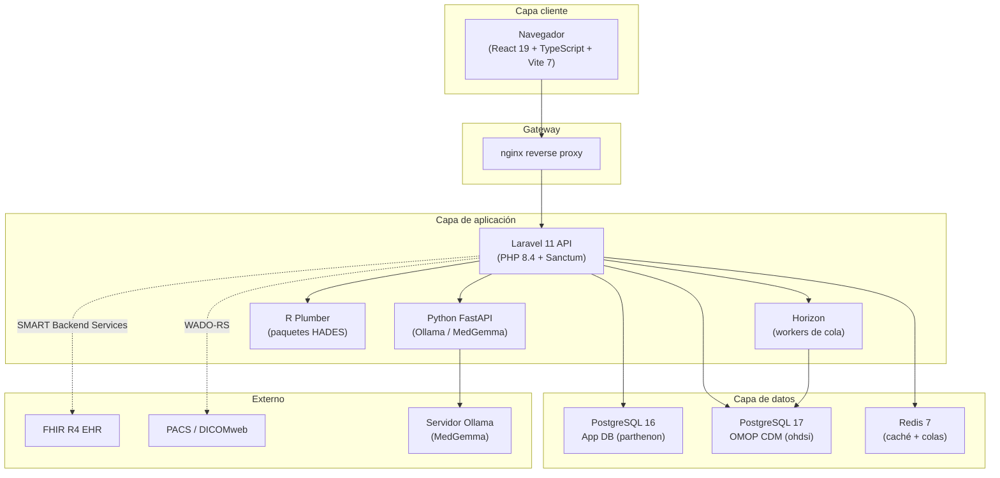

# Introducción a Parthenon

Parthenon es una plataforma unificada de investigación de desenlaces que moderniza y amplía el flujo analítico de OHDSI. Proporciona una aplicación de una sola página basada en React y respaldada por una REST API de Laravel, conectándose a una o más bases de datos OMOP CDM v5.4 para habilitar todo el espectro de investigación con evidencia del mundo real (RWE): desde la exploración de vocabulario y la construcción de cohortes hasta análisis estadísticos avanzados, genómica, imágenes y economía de la salud, todo sin salir del navegador.

## ¿Por qué Parthenon?

El OHDSI Atlas heredado está construido sobre Knockout.js (alrededor de 2013) y requiere un backend WebAPI basado en Java con dependencias de despliegue complejas, incluidas migraciones Flyway, Tomcat y configuración manual de CDM. Parthenon reemplaza toda esta pila por una arquitectura moderna y contenedorizada, manteniendo compatibilidad completa hacia atrás con el ecosistema OHDSI.

### Ventajas clave frente a Atlas

| Área | Atlas | Parthenon |
|------|-------|-----------|
| **Frontend** | Knockout.js, jQuery | React 19 + TypeScript, TailwindCSS v4 |
| **Backend** | Java Spring Boot, WebAPI | Laravel 11 (PHP 8.4), autenticación Sanctum |
| **Autenticación** | Solo BasicAuth o AD | Sesiones Sanctum, SAML 2.0, OIDC, SSO |
| **Autorización** | Modelo plano de permisos | RBAC jerárquico (Spatie) con 4 roles |
| **Integración de IA** | Ninguna | Búsqueda semántica MedGemma, sugerencias NLP de cohortes |
| **Genómica** | Ninguna | Carga VCF, anotación ClinVar, navegador de variantes, tumor boards |
| **Imágenes** | Ninguna | Visor DICOM (Cornerstone3D), WADO-RS/DICOMweb |
| **HEOR** | Ninguna | Modelado de costo-efectividad, brechas de atención, economía poblacional |
| **Integración EHR** | Ninguna | Exportación masiva FHIR R4, SMART Backend Services |
| **Despliegue** | WAR/JAR manual | Docker Compose (un solo comando) |
| **Tipos de análisis** | 5 | 7 (agrega SCCS y Evidence Synthesis) |
| **Compatibilidad WebAPI** | N/A | Completa: HADES, exportaciones Atlas y bibliotecas de fenotipos funcionan |

## Resumen de arquitectura

Parthenon se ejecuta como un conjunto de contenedores Docker orquestados por Docker Compose. Cada servicio tiene una responsabilidad claramente definida:

### Frontend — React 19 + TypeScript

El frontend es una aplicación de una sola página construida con React 19, TypeScript y Vite 7. Usa TailwindCSS v4 para estilos con un tema oscuro carmesí y dorado, Zustand para gestión de estado y TanStack Query para sincronización de estado del servidor. La interfaz es totalmente responsive y está diseñada para estaciones de trabajo de investigación de pantalla grande y monitores estándar.

### Backend API — Laravel 11

La REST API está construida sobre Laravel 11 (PHP 8.4) y maneja autenticación, autorización, operaciones CRUD, despacho de trabajos y orquestación de servicios descendentes. Usa Laravel Sanctum para autenticación SPA con estado y protección CSRF. Las consultas contra OMOP CDM usan clases de modelo dedicadas de solo lectura para prevenir escrituras accidentales en datos clínicos.

### Workers de cola — Laravel Horizon

Las operaciones de larga duración, como generación de cohortes, análisis Achilles, importaciones masivas FHIR y anotación VCF, se despachan como trabajos en segundo plano procesados por workers Laravel Horizon respaldados por Redis. El estado de los trabajos se rastrea en el módulo Trabajos y aparece en la UI con indicadores de progreso en tiempo real.

### Servicio de IA — Python FastAPI

Un microservicio Python FastAPI se conecta a una instancia local de Ollama que ejecuta el modelo MedGemma, o a otros proveedores configurables. Impulsa:

- **Búsqueda semántica de conceptos**: encuentre conceptos por significado clínico, no solo por coincidencia de palabras clave.
- **Sugerencias de cohortes en lenguaje natural**: describa una población de pacientes en inglés y reciba criterios estructurados.
- **Interpretación de resultados**: resúmenes generados por IA de salidas de caracterización y análisis.
- **Anotación de variantes genómicas**: resumen de significancia clínica para variantes identificadas.

:::info Configuración de proveedores de IA
Los administradores pueden configurar hasta 8 proveedores de IA (Ollama, OpenAI, Anthropic, Google, Azure y otros) desde el panel **Admin > AI Providers**. Solo un proveedor está activo a la vez. Ollama con MedGemma es el valor predeterminado para despliegues locales sin datos saliendo de la red.
:::

### Runtime R — API Plumber

Un servicio R Plumber envuelve paquetes OHDSI HADES (CohortGenerator, FeatureExtraction, CohortMethod, PatientLevelPrediction, SelfControlledCaseSeries, EvidenceSynthesis) y se conecta al OMOP CDM mediante JDBC. El backend Laravel despacha trabajos de análisis a este servicio cuando se requieren métodos estadísticos basados en R.

### Bases de datos

Parthenon usa dos bases de datos PostgreSQL separadas:

- **App DB (PostgreSQL 16)**: almacena metadatos de aplicación: usuarios, roles, sesiones, configuraciones de fuentes, definiciones de cohortes, conjuntos de conceptos, ajustes de análisis y registros de trabajos. Esta base se gestiona mediante migraciones Laravel.
- **CDM DB (PostgreSQL 17)**: contiene los datos clínicos OMOP CDM, tablas de vocabulario y resultados Achilles. Desde la perspectiva de Parthenon, esta base es de solo lectura, excepto en esquemas de resultados donde se escriben tablas de cohortes y salidas Achilles.

:::warning Dos bases de datos, no una
Un malentendido común es que Parthenon almacena todo en una sola base de datos. La base de aplicación y la base CDM son instancias PostgreSQL separadas. Reiniciar la base de aplicación, por ejemplo con `migrate:fresh`, no afecta los datos clínicos, pero sí destruye configuraciones de fuentes, definiciones de cohortes y cuentas de usuario. Haga siempre una copia de seguridad antes de reiniciar.
:::

## Autenticación

Parthenon admite múltiples mecanismos de autenticación:

### Autenticación por sesión Sanctum (predeterminada)

La autenticación integrada usa Laravel Sanctum con sesiones basadas en cookies y protección CSRF. Los usuarios se registran con una dirección de correo electrónico y reciben una contraseña temporal que deben cambiar en el primer inicio de sesión.

### SAML 2.0

Para inicio de sesión único empresarial, Parthenon admite proveedores de identidad SAML 2.0 (Azure AD, Okta, OneLogin, ADFS, etc.). Configure la URL de metadatos de su IdP y los mapeos de atributos en **Admin > Authentication Providers**.

### OpenID Connect (OIDC)

Los proveedores OIDC (Keycloak, Auth0, Google Workspace, etc.) pueden configurarse para autenticación federada. Parthenon maneja el flujo de código de autorización y mapea claims OIDC a roles locales de usuario.

:::tip Primer inicio de sesión
Cuando se crea una nueva cuenta de usuario, ya sea por un administrador o mediante autorregistro, se envía una contraseña temporal al usuario por correo electrónico. En el primer inicio de sesión, un modal bloqueante exige establecer una nueva contraseña antes de acceder a cualquier función de la plataforma.
:::

## Roles y permisos de usuario

Parthenon usa un sistema jerárquico de control de acceso basado en roles, impulsado por Spatie Laravel Permission. Cuatro roles integrados proporcionan acceso progresivamente más amplio:

| Rol | Descripción | Capacidades clave |
|-----|-------------|-------------------|
| **super-admin** | Control total de la plataforma | Todos los permisos, configuración del sistema, ajustes de proveedores de IA, gestión de proveedores de autenticación, cargas de vocabulario |
| **admin** | Gestión organizacional | Gestión de usuarios, configuración de fuentes de datos, asignación de roles, configuración de conexiones FHIR |
| **researcher** | Investigación clínica | Crear/editar cohortes, conjuntos de conceptos y análisis; ejecutar análisis; acceder a perfiles de pacientes; cargar archivos VCF/DICOM |
| **viewer** | Acceso de solo lectura | Explorar vocabularios, ver definiciones y resultados de cohortes, exportar datos; no puede crear ni modificar |

Su rol actual se muestra en el menú de usuario, en la esquina superior derecha. Contacte a su administrador para solicitar acceso elevado.

### Granularidad de permisos

Además de roles, pueden asignarse permisos individuales para control detallado:

- `view patients`: requerido para acceder a Perfiles de pacientes (sensible a PHI).
- `manage sources`: requerido para agregar, editar o eliminar configuraciones de fuentes de datos.
- `manage users`: requerido para crear cuentas y asignar roles.
- `run analyses`: requerido para ejecutar análisis, no solo verlos.
- `upload genomics`: requerido para cargar archivos VCF.
- `view imaging`: requerido para acceder al visor DICOM.

## Requisitos del sistema

### Para usuarios finales

- Un navegador moderno: Chrome 120+, Firefox 120+, Safari 17+ o Edge 120+.
- Acceso de red a la URL del servidor Parthenon.
- Una cuenta de usuario con un rol apropiado.

### Para administradores

- Docker Engine 24+ y Docker Compose v2.
- Al menos 8 GB de RAM para la pila completa de servicios (16 GB recomendado).
- PostgreSQL 16+ para la base de datos de aplicación.
- PostgreSQL con tablas OMOP CDM v5.4 pobladas, o el conjunto de demostración Eunomia incluido.
- Opcional: Ollama con MedGemma para funciones de IA; servidor PACS para imágenes; EHR habilitado para FHIR para integración.

## Inicio de sesión

1. Navegue a la URL de Parthenon proporcionada por su administrador, por ejemplo `https://parthenon.yourorg.net`.
2. Ingrese su dirección de correo electrónico y contraseña.
3. Haga clic en **Sign In**.
4. En el primer inicio de sesión, se le pedirá cambiar la contraseña temporal mediante un modal bloqueante.

:::tip Configuración inicial para super-admins
Después del despliegue inicial, el primer usuario super-admin se crea mediante el instalador o con `php artisan admin:seed`. En el primer inicio de sesión, la plataforma presenta un **Setup Wizard**: una configuración guiada de seis pasos que cubre verificación de salud del sistema, configuración de proveedor de IA, configuración de autenticación y registro de fuentes de datos. Los usuarios regulares ven un recorrido de incorporación más simple.
:::

## Navegación principal

La barra de navegación superior proporciona acceso a todos los módulos de la plataforma. Los elementos disponibles dependen de su rol y permisos.

| Elemento de menú | Módulo | Rol requerido |
|------------------|--------|---------------|
| **Data Sources** | Explorar y configurar conexiones OMOP CDM | viewer+ |
| **Vocabulary** | Buscar conceptos, crear conjuntos de conceptos | viewer+ |
| **Cohorts** | Definir, generar y gestionar cohortes de pacientes | researcher+ |
| **Analyses** | Ejecutar los siete tipos de análisis | researcher+ |
| **Studies** | Empaquetar análisis en definiciones de estudio reproducibles | researcher+ |
| **Data Explorer** | Tableros Achilles, calidad de datos, estadísticas poblacionales | viewer+ |
| **Patients** | Líneas de tiempo individuales de pacientes | researcher+ con `view patients` |
| **Data Ingestion** | Cargar y mapear datos fuente a OMOP CDM | admin+ |
| **Genomics** | Carga VCF, navegador de variantes, tumor boards | researcher+ con `upload genomics` |
| **Imaging** | Visor DICOM, conexiones PACS | researcher+ con `view imaging` |
| **HEOR** | Economía de la salud, brechas de atención, analítica poblacional | researcher+ |
| **Jobs** | Monitorear tareas en segundo plano | viewer+ |
| **Admin** | Usuarios, roles, autenticación, IA, salud del sistema, vocabulario, FHIR, sincronización | admin+ |

## Conjunto completo de funciones

### Vocabulario y gestión de conceptos

- Búsqueda de texto completo y semántica impulsada por IA en más de 7.2M conceptos OMOP.
- Vista de detalle de concepto con navegación jerárquica (ancestros, descendientes, relaciones).
- Herramienta de comparación de conceptos lado a lado.
- Conjuntos de conceptos reutilizables con indicadores de descendientes, mapeados y exclusión.
- Importación/exportación JSON compatible con OHDSI para conjuntos de conceptos.
- Gestión administrativa de vocabulario: carga de paquetes ZIP Athena para actualizar tablas de conceptos.

### Construcción y gestión de cohortes

- Constructor visual de expresiones de cohorte con criterios de inclusión/exclusión.
- Lógica temporal: eventos con ventanas de tiempo y criterios secuenciales.
- Grupos de criterios anidados con lógica AND/OR.
- Integración de conjuntos de conceptos con vista previa de resolución en vivo.
- Generación de cohortes contra cualquier fuente de datos configurada.
- Historial de generación con conteos de registros y tiempos de ejecución.
- Comparación de cohortes y análisis de superposición.
- Importación/exportación de definiciones de cohortes como JSON compatible con OHDSI.

### Análisis (7 tipos)

- **Caracterización**: extracción de características basales para una o más cohortes.
- **Tasas de incidencia**: calcular incidencia de desenlaces en poblaciones objetivo.
- **Rutas de tratamiento**: visualizar secuencias de tratamientos (diagramas sunburst).
- **Estimación a nivel poblacional (PLE)**: inferencia causal usando puntuaciones de propensión.
- **Predicción a nivel de paciente (PLP)**: construir y validar modelos predictivos.
- **Serie de casos autocontrolada (SCCS)**: diseños de estudio dentro de la persona.
- **Síntesis de evidencia**: metaanálisis entre múltiples bases de datos o análisis.

### Explorador de datos

- Caracterización CDM basada en Achilles: demografía, condiciones, medicamentos, mediciones.
- Data Quality Dashboard (DQD) con verificaciones heel e indicadores de calidad por dominio.
- Estadísticas poblacionales con visualización de tendencias.
- Comparación multi-fuente con selector desplegable de fuentes.

### Genómica

- Carga de archivos VCF con análisis y almacenamiento automáticos.
- Anotación ClinVar para evaluación de significancia clínica.
- Navegador interactivo de variantes con filtros por gen, consecuencia y significancia.
- Interfaz de tumor board virtual con interpretación de variantes asistida por IA.
- Integración de criterios genómicos en definiciones de cohortes.

### Imágenes médicas

- Visor DICOM integrado impulsado por Cornerstone3D.
- Conectividad PACS mediante WADO-RS / DICOMweb.
- Exploración de estudios y series con visualización de metadatos.
- Criterios de imágenes disponibles en el constructor de cohortes.

### Economía de la salud e investigación de desenlaces (HEOR)

- Modelado y análisis de costo-efectividad.
- Identificación de brechas de atención en poblaciones de pacientes.
- Analítica económica a nivel poblacional con métricas configurables.
- Integración con análisis basados en cohortes para evaluación económica dirigida.

### Integración EHR

- Conectividad FHIR R4 mediante SMART Backend Services.
- Exportación masiva de datos desde sistemas EHR habilitados para FHIR.
- Sincronización incremental para mantener actualizados los datos CDM.
- Gestión de conexiones y panel de sincronización en Administración.

### Administración

- Gestión de usuarios: crear, editar y desactivar cuentas.
- Asignación de roles y permisos con RBAC jerárquico.
- Configuración de proveedores de autenticación (local, SAML 2.0, OIDC).
- Configuración de proveedores de IA (8 proveedores admitidos, credenciales cifradas).
- Dashboard de salud del sistema con monitoreo de todos los servicios y actualización automática.
- Gestión de vocabulario: carga de paquetes Athena.
- Gestión de conexiones FHIR y panel de sincronización.
- Registro de auditoría de acciones relevantes para seguridad.

## Obtener ayuda

- **Ayuda en la aplicación**: haga clic en el icono de ayuda en la navegación superior para documentación contextual y recorridos guiados.
- **Manual de usuario**: lo está leyendo. Use la barra lateral para navegar a capítulos específicos.
- **Referencia de API**: disponible en [`/docs/api`](/api/) con documentación completa de endpoints generada desde el código.
- **Atajos de teclado**: consulte el [Apéndice A](../appendices/a-keyboard-shortcuts) para la lista completa.
- **Solución de problemas**: consulte el [Apéndice G](../appendices/g-troubleshooting) para problemas comunes y soluciones.

## Siguientes pasos

Ahora que entiende la arquitectura y capacidades de la plataforma, continúe con el [Capítulo 2: Fuentes de datos](./02-data-sources) para aprender a configurar conexiones a sus bases de datos OMOP CDM, la base de todas las actividades de investigación en Parthenon.
