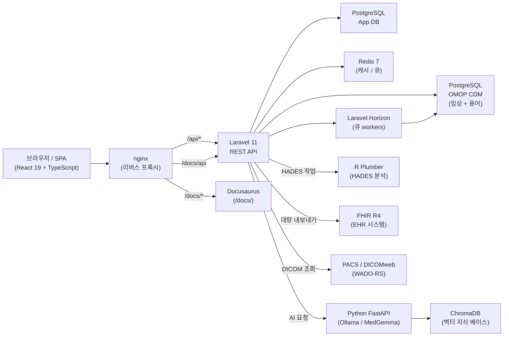
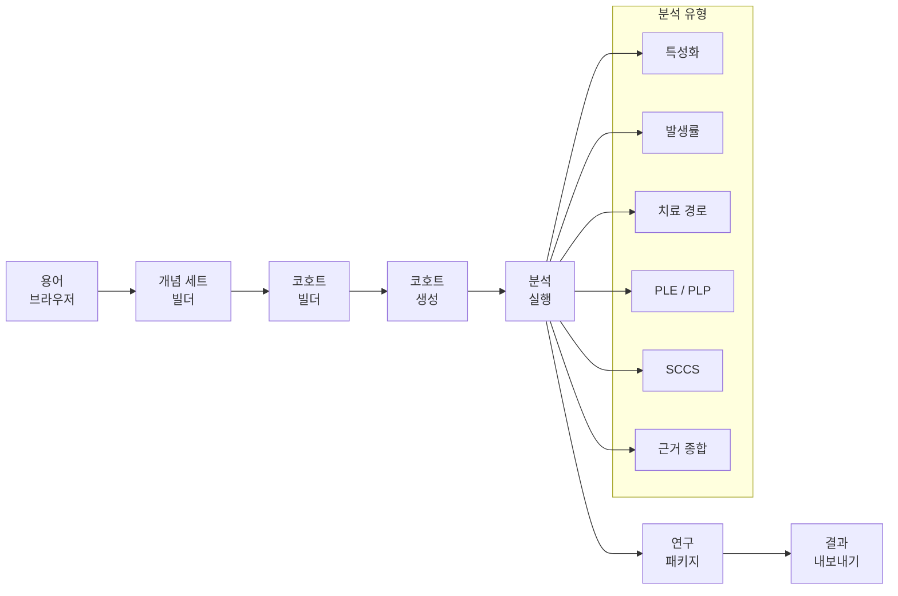

# Parthenon 사용자 매뉴얼

**Parthenon**에 오신 것을 환영합니다. Parthenon은 [OMOP Common Data Model v5.4](https://ohdsi.github.io/CommonDataModel/) 위에 구축된 차세대 통합 결과 연구 플랫폼입니다. Parthenon은 기존 OHDSI Atlas를 현대적이고 빠르며 확장 가능한 인터페이스로 대체하면서도 HADES, CohortGenerator, Circe를 포함한 OHDSI 분석 도구 체계와 완전한 호환성을 유지합니다.

## Parthenon이란?

Parthenon은 실세계 근거(RWE) 연구 생애주기 전체를 위한 단일 브라우저 기반 인터페이스를 제공합니다. 연구자는 용어 탐색과 개념 세트 구성에서 시작해 시각적 빌더로 환자 코호트를 만들고, 특성화, 발생률, 치료 경로, 모집단 수준 추정, 환자 수준 예측, 자기대조 사례군 연구, 근거 종합까지 전체 분석 범위를 플랫폼 안에서 실행할 수 있습니다.

전통적인 OHDSI 분석을 넘어 Parthenon은 Atlas가 다루지 못했던 영역까지 확장됩니다:

- **유전체학**: VCF 파일을 업로드하고, ClinVar와 대조해 변이를 주석화하며, 인터랙티브 변이 브라우저에서 돌연변이를 탐색하고, AI 보조 해석이 포함된 가상 tumor board를 진행합니다.
- **의료 영상**: 내장 Cornerstone3D 뷰어로 DICOM 연구를 보고, WADO-RS를 통해 PACS 시스템에 연결하며, 영상 기준을 코호트 정의에 통합합니다.
- **보건경제 및 결과 연구(HEOR)**: 비용-효과를 모델링하고, 모집단 전반의 진료 격차를 식별하며, 모집단 수준 경제 분석을 실행합니다.
- **FHIR R4 통합**: SMART Backend Services로 EHR 시스템에 연결해 임상 데이터를 OMOP CDM으로 자동 대량 내보내기 및 증분 동기화합니다.
- **AI 보조 분석**: Ollama와 MedGemma 기반의 통합 AI 서비스가 의미 기반 개념 검색, 자연어 코호트 제안, 임상 결과 해석, 유전체 변이 요약을 제공합니다.

Parthenon은 OHDSI WebAPI와 호환되는 REST API를 노출하므로 기존 도구, 표현형 라이브러리, 연구 패키지를 수정 없이 계속 사용할 수 있습니다.

## 매뉴얼 구조

| 파트 | 장 | 주제 |
|------|----|------|
| [I — 시작하기](part1-getting-started/01-introduction) | 1--2 | 플랫폼 소개, 아키텍처, 데이터 소스 |
| [II — 용어](part2-vocabulary/03-vocabulary-browser) | 3--4 | 용어 브라우저, 개념 세트 |
| [III — 코호트](part3-cohorts/05-cohort-expressions) | 5--8 | 코호트 표현식, 작성, 생성, 관리 |
| [IV — 분석](part4-analyses/09-characterization) | 9--14 | 일곱 가지 분석 유형과 연구 패키지 |
| [V — 데이터 수집](part5-ingestion/15-uploading-data) | 15--17 | 데이터 업로드, 스키마 매핑, 개념 매핑 |
| [VI — 데이터 탐색기](part6-data-explorer/18-characterization-achilles) | 18--20 | Achilles 특성화, 데이터 품질, 모집단 통계 |
| [VII — 환자 프로필](part7-patient-profiles/21-patient-timelines) | 21 | 개별 환자 타임라인 |
| [VIII — 관리](part8-administration/22-user-management) | 22--26 | 사용자, 역할, 인증 제공자, 시스템 구성, 감사 |
| [마이그레이션 가이드](migration) | -- | Atlas에서 Parthenon으로 마이그레이션 |
| [부록](appendices/a-keyboard-shortcuts) | A--G | 참고 자료 |

## 플랫폼 아키텍처

Parthenon은 Docker Compose로 오케스트레이션되는 컨테이너 기반 다중 서비스 애플리케이션입니다. 각 서비스는 목적이 명확하며 독립적으로 확장할 수 있습니다.

### 서비스 요약

| 서비스 | 기술 | 목적 |
|--------|------|------|
| **Frontend** | React 19, TypeScript, Vite 7, TailwindCSS v4 | 어두운 크림슨/골드 테마의 단일 페이지 애플리케이션 |
| **Backend API** | Laravel 11, PHP 8.4, Sanctum | RESTful API, 인증, 권한 부여, 작업 dispatch |
| **큐 Worker** | Laravel Horizon, Redis 7 | 백그라운드 작업: 코호트 생성, Achilles, 대량 가져오기 |
| **AI 서비스** | Python FastAPI, Ollama, MedGemma | 의미 검색, NLP 코호트 제안, 변이 해석 |
| **R Runtime** | R Plumber, HADES 패키지 | JDBC를 통해 OMOP CDM에 연결하는 통계 분석 |
| **데이터베이스(App)** | PostgreSQL 16 | 애플리케이션 메타데이터: 사용자, 소스, 코호트 정의 |
| **데이터베이스(CDM)** | PostgreSQL 17 | OMOP CDM 임상 데이터, 용어, Achilles 결과 |
| **캐시** | Redis 7 | 세션 저장소, 쿼리 캐시, 큐 브로커 |

## 플랫폼 모듈

Parthenon은 기능을 다음 모듈로 구성합니다:

### 임상 연구

- **데이터 소스**: 스키마별 daimon을 사용해 하나 이상의 OMOP CDM 데이터베이스 연결을 구성합니다.
- **용어**: 텍스트 및 AI 기반 의미 검색으로 720만 개 이상의 OMOP 개념을 검색하고 개념을 나란히 비교합니다.
- **개념 세트**: 하위 개념, 매핑, 제외 플래그를 포함한 재사용 가능한 개념 목록을 만듭니다.
- **코호트 빌더**: 포함 기준, censoring 이벤트, 시간 로직으로 코호트를 시각적으로 정의합니다.
- **분석**: 일곱 가지 분석 유형: 특성화, 발생률, 치료 경로, 모집단 수준 추정(PLE), 환자 수준 예측(PLP), 자기대조 사례군 연구(SCCS), 근거 종합.
- **연구**: 여러 분석을 다중 사이트 실행을 위한 재현 가능한 연구 정의로 패키징합니다.
- **환자 프로필**: 도메인별 이벤트 시각화를 통해 개별 환자 타임라인을 자세히 살펴봅니다.

### 데이터 관리

- **데이터 탐색기**: Achilles 기반 특성화 대시보드, 데이터 품질 검사(DQD), 모집단 통계.
- **데이터 수집**: CSV/TSV 파일을 업로드하고, 스키마를 OMOP CDM 테이블에 매핑하며, 원천 코드를 표준 개념에 매핑합니다.
- **용어 관리**: Athena 용어 ZIP 번들을 업로드해 개념 테이블을 갱신합니다(관리자).

### 고급 모듈

- **유전체학**: VCF 파일 업로드, ClinVar 주석화, 인터랙티브 변이 브라우저, AI 보조 해석을 포함한 가상 tumor board.
- **영상**: Cornerstone3D로 DICOM 연구를 인라인으로 보고, WADO-RS/DICOMweb을 통해 PACS에 연결하며, 영상 기준을 코호트 정의에 사용합니다.
- **HEOR**: 보건경제 모델링, 비용-효과 분석, 진료 격차 식별, 모집단 수준 경제 분석.

### 통합 및 관리

- **FHIR R4**: EHR 시스템에서 자동 대량 데이터 내보내기와 증분 동기화를 위한 SMART Backend Services.
- **작업**: 코호트 생성, Achilles 실행, 대량 가져오기, FHIR 동기화 같은 백그라운드 작업을 모니터링합니다.
- **관리**: 사용자 관리, 역할 및 권한 할당, 인증 제공자(SAML 2.0, OIDC), AI 제공자 구성, 시스템 상태 모니터링, FHIR 연결 관리, 동기화 대시보드.

## 연구 워크플로

Parthenon의 일반적인 연구 워크플로는 용어 탐색에서 게시 가능한 결과까지 구조화된 pipeline을 따릅니다:

:::tip OMOP이 처음이신가요?
OMOP Common Data Model이 처음이라면 [용어 브라우저](part2-vocabulary/03-vocabulary-browser) 장부터 시작해 임상 개념이 어떻게 구성되는지 이해하세요. 용어는 Parthenon의 모든 코호트 정의와 분석의 기반입니다.
:::

## 빠른 링크

- [소개 및 아키텍처](part1-getting-started/01-introduction)
- [데이터 소스 구성](part1-getting-started/02-data-sources)
- [첫 코호트 만들기](part3-cohorts/06-building-cohorts)
- [분석 실행](part4-analyses/09-characterization)
- [API 참조](/api/)
- [키보드 단축키](appendices/a-keyboard-shortcuts)
- [용어집](appendices/e-glossary)
- [Atlas에서 마이그레이션](migration)
- [문제 해결](appendices/g-troubleshooting)
