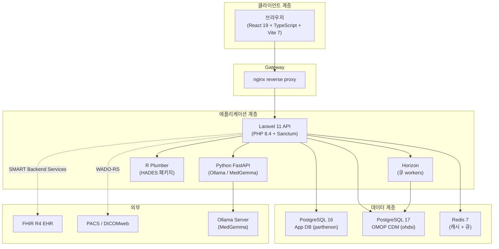

# Parthenon 소개

Parthenon은 OHDSI 분석 워크플로를 현대화하고 확장하는 통합 결과 연구 플랫폼입니다. Laravel REST API가 뒷받침하는 React 기반 단일 페이지 애플리케이션을 제공하며, 하나 이상의 OMOP CDM v5.4 데이터베이스에 연결해 용어 탐색과 코호트 구성부터 고급 통계 분석, 유전체학, 영상, 보건경제까지 실세계 근거(RWE) 연구의 전체 범위를 브라우저 안에서 수행할 수 있게 합니다.

## 왜 Parthenon인가?

기존 OHDSI Atlas는 Knockout.js(2013년경)를 기반으로 하며 Flyway 마이그레이션, Tomcat, 수동 CDM 구성 등 복잡한 배포 의존성을 가진 Java 기반 WebAPI backend가 필요합니다. Parthenon은 이 전체 스택을 현대적인 컨테이너 기반 아키텍처로 대체하면서도 OHDSI 생태계와 완전한 이전 호환성을 유지합니다.

### Atlas 대비 주요 장점

| 영역 | Atlas | Parthenon |
|------|-------|-----------|
| **Frontend** | Knockout.js, jQuery | React 19 + TypeScript, TailwindCSS v4 |
| **Backend** | Java Spring Boot, WebAPI | Laravel 11 (PHP 8.4), Sanctum 인증 |
| **인증** | BasicAuth 또는 AD만 지원 | Sanctum 세션, SAML 2.0, OIDC, SSO |
| **권한 부여** | 평면 권한 모델 | 4개 역할을 가진 계층형 RBAC(Spatie) |
| **AI 통합** | 없음 | MedGemma 의미 검색, NLP 코호트 제안 |
| **유전체학** | 없음 | VCF 업로드, ClinVar 주석화, 변이 브라우저, tumor board |
| **영상** | 없음 | DICOM 뷰어(Cornerstone3D), WADO-RS/DICOMweb |
| **HEOR** | 없음 | 비용-효과 모델링, 진료 격차, 인구집단 경제 분석 |
| **EHR 통합** | 없음 | FHIR R4 대량 내보내기, SMART Backend Services |
| **배포** | 수동 WAR/JAR | Docker Compose(단일 명령) |
| **분석 유형** | 5 | 7(SCCS, Evidence Synthesis 추가) |
| **WebAPI 호환성** | N/A | 완전함: HADES, Atlas 내보내기, 표현형 라이브러리 동작 |

## 아키텍처 개요

Parthenon은 Docker Compose로 오케스트레이션되는 Docker 컨테이너 집합으로 실행됩니다. 각 서비스는 명확히 정의된 책임을 가집니다:

### Frontend — React 19 + TypeScript

Frontend는 React 19, TypeScript, Vite 7로 구축된 단일 페이지 애플리케이션입니다. 어두운 크림슨/골드 디자인 테마의 스타일링에는 TailwindCSS v4를, 상태 관리에는 Zustand를, 서버 상태 동기화에는 TanStack Query를 사용합니다. UI는 완전 반응형이며 대형 연구 워크스테이션과 일반 모니터 모두에 맞게 설계되었습니다.

### Backend API — Laravel 11

REST API는 Laravel 11(PHP 8.4) 기반이며 인증, 권한 부여, CRUD 작업, 작업 dispatch, 하위 서비스 오케스트레이션을 처리합니다. CSRF 보호가 포함된 상태 유지 SPA 인증에는 Laravel Sanctum을 사용합니다. OMOP CDM에 대한 데이터베이스 쿼리는 전용 읽기 전용 모델 클래스를 사용해 임상 데이터에 대한 우발적 쓰기를 방지합니다.

### 큐 Workers — Laravel Horizon

코호트 생성, Achilles 분석, 대량 FHIR 가져오기, VCF 주석화 같은 장기 실행 작업은 Redis 기반 Laravel Horizon workers가 처리하는 백그라운드 작업으로 dispatch됩니다. 작업 상태는 Jobs 모듈에서 추적되며 실시간 진행 표시와 함께 UI에 표시됩니다.

### AI 서비스 — Python FastAPI

Python FastAPI 마이크로서비스는 MedGemma 모델을 실행하는 로컬 Ollama 인스턴스 또는 다른 구성 가능한 제공자에 연결됩니다. 이 서비스는 다음을 구동합니다:

- **의미 기반 개념 검색**: 단순 키워드 일치가 아니라 임상적 의미로 개념을 찾습니다.
- **자연어 코호트 제안**: 환자 모집단을 영어로 설명하면 구조화된 기준을 받습니다.
- **결과 해석**: 특성화 및 분석 출력에 대한 AI 생성 요약.
- **유전체 변이 주석화**: 식별된 변이에 대한 임상적 의의 요약.

:::info AI 제공자 구성
관리자는 **Admin > AI Providers** 패널에서 최대 8개의 AI 제공자(Ollama, OpenAI, Anthropic, Google, Azure 등)를 구성할 수 있습니다. 한 번에 하나의 제공자만 활성화됩니다. MedGemma를 사용하는 Ollama는 네트워크 밖으로 데이터가 나가지 않는 온프레미스 배포의 기본값입니다.
:::

### R Runtime — Plumber API

R Plumber 서비스는 OHDSI HADES 패키지(CohortGenerator, FeatureExtraction, CohortMethod, PatientLevelPrediction, SelfControlledCaseSeries, EvidenceSynthesis)를 감싸고 JDBC를 통해 OMOP CDM에 연결합니다. R 기반 통계 방법이 필요할 때 Laravel backend가 이 서비스로 분석 작업을 dispatch합니다.

### 데이터베이스

Parthenon은 두 개의 별도 PostgreSQL 데이터베이스를 사용합니다:

- **App DB(PostgreSQL 16)**: 사용자, 역할, 세션, 소스 구성, 코호트 정의, 개념 세트, 분석 설정, 작업 기록 같은 애플리케이션 메타데이터를 저장합니다. 이 데이터베이스는 Laravel 마이그레이션으로 관리됩니다.
- **CDM DB(PostgreSQL 17)**: OMOP CDM 임상 데이터, 용어 테이블, Achilles 결과를 포함합니다. 결과 스키마에 코호트 테이블과 Achilles 출력이 기록되는 경우를 제외하면 Parthenon 관점에서는 읽기 전용입니다.

:::warning 두 데이터베이스, 하나가 아닙니다
Parthenon이 모든 것을 단일 데이터베이스에 저장한다고 오해하기 쉽습니다. 애플리케이션 데이터베이스와 CDM 데이터베이스는 별도의 PostgreSQL 인스턴스입니다. 앱 데이터베이스를 재설정하면(예: `migrate:fresh`) 임상 데이터에는 영향을 주지 않지만 모든 소스 구성, 코호트 정의, 사용자 계정이 삭제됩니다. 재설정 전에 항상 백업하세요.
:::

## 인증

Parthenon은 여러 인증 메커니즘을 지원합니다:

### Sanctum 세션 인증(기본값)

내장 인증은 쿠키 기반 세션과 CSRF 보호가 포함된 Laravel Sanctum을 사용합니다. 사용자는 이메일 주소로 등록하고 첫 로그인 시 변경해야 하는 임시 비밀번호를 받습니다.

### SAML 2.0

기업 싱글 사인온을 위해 Parthenon은 SAML 2.0 ID 제공자(Azure AD, Okta, OneLogin, ADFS 등)를 지원합니다. **Admin > Authentication Providers**에서 IdP 메타데이터 URL과 속성 매핑을 구성하세요.

### OpenID Connect(OIDC)

OIDC 제공자(Keycloak, Auth0, Google Workspace 등)는 federated 인증용으로 구성할 수 있습니다. Parthenon은 authorization code flow를 처리하고 OIDC claims를 로컬 사용자 역할에 매핑합니다.

:::tip 첫 로그인
관리자가 만들었든 자가 등록을 통해 만들었든 새 사용자 계정이 생성되면 임시 비밀번호가 이메일로 전송됩니다. 첫 로그인 시 차단 modal이 새 비밀번호 설정을 요구하며, 그 전에는 플랫폼 기능에 접근할 수 없습니다.
:::

## 사용자 역할 및 권한

Parthenon은 Spatie Laravel Permission으로 구동되는 계층형 역할 기반 접근 제어 시스템을 사용합니다. 네 가지 내장 역할은 점진적으로 더 넓은 접근 권한을 제공합니다:

| 역할 | 설명 | 주요 기능 |
|------|------|-----------|
| **super-admin** | 전체 플랫폼 제어 | 모든 권한, 시스템 구성, AI 제공자 설정, 인증 제공자 관리, 용어 업로드 |
| **admin** | 조직 관리 | 사용자 관리, 데이터 소스 구성, 역할 할당, FHIR 연결 설정 |
| **researcher** | 임상 연구 | 코호트, 개념 세트, 분석 생성/수정; 분석 실행; 환자 프로필 접근; VCF/DICOM 파일 업로드 |
| **viewer** | 읽기 전용 접근 | 용어 탐색, 코호트 정의와 결과 보기, 데이터 내보내기; 생성 또는 수정 불가 |

현재 역할은 오른쪽 상단 사용자 메뉴에 표시됩니다. 더 높은 접근 권한이 필요하면 관리자에게 요청하세요.

### 권한 세분성

역할 외에도 세밀한 제어를 위해 개별 권한을 할당할 수 있습니다:

- `view patients`: 환자 프로필 접근에 필요합니다(PHI 민감).
- `manage sources`: 데이터 소스 구성을 추가, 수정, 삭제하는 데 필요합니다.
- `manage users`: 계정을 만들고 역할을 할당하는 데 필요합니다.
- `run analyses`: 분석을 보는 것뿐 아니라 실행하는 데 필요합니다.
- `upload genomics`: VCF 파일 업로드에 필요합니다.
- `view imaging`: DICOM 뷰어 접근에 필요합니다.

## 시스템 요구 사항

### 최종 사용자

- 최신 브라우저: Chrome 120+, Firefox 120+, Safari 17+ 또는 Edge 120+.
- Parthenon 서버 URL에 대한 네트워크 접근.
- 적절한 역할을 가진 사용자 계정.

### 관리자

- Docker Engine 24+ 및 Docker Compose v2.
- 전체 서비스 스택을 위한 최소 8 GB RAM(16 GB 권장).
- 앱 데이터베이스용 PostgreSQL 16+.
- OMOP CDM v5.4 테이블이 채워진 PostgreSQL, 또는 포함된 Eunomia 데모 데이터셋.
- 선택 사항: AI 기능을 위한 Ollama 및 MedGemma, 영상용 PACS 서버, 통합용 FHIR 지원 EHR.

## 로그인

1. 관리자가 제공한 Parthenon URL로 이동합니다(예: `https://parthenon.yourorg.net`).
2. 이메일 주소와 비밀번호를 입력합니다.
3. **Sign In**을 클릭합니다.
4. 첫 로그인 시 차단 modal을 통해 임시 비밀번호를 변경하라는 안내가 표시됩니다.

:::tip super-admin 첫 설정
초기 배포 후 첫 super-admin 사용자는 설치 프로그램 또는 `php artisan admin:seed`로 생성됩니다. 첫 로그인 시 플랫폼은 시스템 상태 확인, AI 제공자 설정, 인증 구성, 데이터 소스 등록을 포함하는 6단계 **Setup Wizard**를 표시합니다. 일반 사용자는 더 간단한 온보딩 투어를 보게 됩니다.
:::

## 주요 내비게이션

상단 내비게이션 바는 모든 플랫폼 모듈에 대한 접근을 제공합니다. 사용할 수 있는 항목은 역할과 권한에 따라 달라집니다.

| 메뉴 항목 | 모듈 | 필요한 역할 |
|-----------|------|-------------|
| **Data Sources** | OMOP CDM 연결 탐색 및 구성 | viewer+ |
| **Vocabulary** | 개념 검색, 개념 세트 작성 | viewer+ |
| **Cohorts** | 환자 코호트 정의, 생성, 관리 | researcher+ |
| **Analyses** | 일곱 가지 분석 유형 실행 | researcher+ |
| **Studies** | 분석을 재현 가능한 연구 정의로 패키징 | researcher+ |
| **Data Explorer** | Achilles 대시보드, 데이터 품질, 모집단 통계 | viewer+ |
| **Patients** | 개별 환자 타임라인 | `view patients` 권한이 있는 researcher+ |
| **Data Ingestion** | 원천 데이터를 OMOP CDM으로 업로드 및 매핑 | admin+ |
| **Genomics** | VCF 업로드, 변이 브라우저, tumor board | `upload genomics` 권한이 있는 researcher+ |
| **Imaging** | DICOM 뷰어, PACS 연결 | `view imaging` 권한이 있는 researcher+ |
| **HEOR** | 보건경제, 진료 격차, 모집단 분석 | researcher+ |
| **Jobs** | 백그라운드 작업 모니터링 | viewer+ |
| **Admin** | 사용자, 역할, 인증, AI, 시스템 상태, 용어, FHIR, 동기화 | admin+ |

## 전체 기능 세트

### 용어 및 개념 관리

- 720만 개 이상의 OMOP 개념에 대한 전체 텍스트 및 AI 기반 의미 검색.
- 계층 탐색(상위, 하위, 관계)이 포함된 개념 상세 보기.
- 나란히 평가할 수 있는 개념 비교 도구.
- 하위 개념, 매핑, 제외 플래그를 가진 재사용 가능한 개념 세트.
- 개념 세트용 OHDSI 호환 JSON 가져오기/내보내기.
- 관리자 용어 관리: Athena ZIP 번들을 업로드해 개념 테이블 갱신.

### 코호트 작성 및 관리

- 포함/제외 기준이 있는 시각적 코호트 표현식 빌더.
- 시간 로직: 시간 창 이벤트와 순차 기준.
- AND/OR 로직이 있는 중첩 기준 그룹.
- 실시간 해결 미리보기가 포함된 개념 세트 통합.
- 구성된 모든 데이터 소스에 대한 코호트 생성.
- 레코드 수와 실행 시간이 포함된 생성 기록.
- 코호트 비교 및 중복 분석.
- OHDSI 호환 JSON으로 코호트 정의 가져오기/내보내기.

### 분석(7가지 유형)

- **특성화**: 하나 이상의 코호트에 대한 기준 특징 추출.
- **발생률**: 대상 모집단에서 결과 발생률 계산.
- **치료 경로**: 치료 순서 시각화(sunburst diagrams).
- **모집단 수준 추정(PLE)**: 성향 점수를 사용한 인과 추론.
- **환자 수준 예측(PLP)**: 예측 모델 구축 및 검증.
- **자기대조 사례군 연구(SCCS)**: 개인 내 연구 설계.
- **근거 종합**: 여러 데이터베이스 또는 분석 간 메타분석.

### 데이터 탐색기

- Achilles 기반 CDM 특성화: 인구통계, 질환, 약물, 측정.
- heel checks와 도메인 수준 품질 지표가 포함된 Data Quality Dashboard(DQD).
- 추세 시각화가 포함된 모집단 통계.
- 소스 선택 드롭다운을 통한 다중 소스 비교.

### 유전체학

- 자동 파싱 및 저장이 포함된 VCF 파일 업로드.
- 임상적 의의 평가를 위한 ClinVar 주석화.
- 유전자, 결과, 의의별 필터링이 있는 인터랙티브 변이 브라우저.
- AI 보조 변이 해석이 포함된 가상 tumor board 인터페이스.
- 코호트 정의에 유전체 기준 통합.

### 의료 영상

- Cornerstone3D 기반 내장 DICOM 뷰어.
- WADO-RS / DICOMweb을 통한 PACS 연결.
- 메타데이터 표시가 포함된 연구 및 시리즈 탐색.
- 코호트 빌더에서 사용할 수 있는 영상 기준.

### 보건경제 및 결과 연구(HEOR)

- 비용-효과 모델링 및 분석.
- 환자 모집단 전반의 진료 격차 식별.
- 구성 가능한 메트릭이 있는 모집단 수준 경제 분석.
- 대상 경제 평가를 위한 코호트 기반 분석과의 통합.

### EHR 통합

- SMART Backend Services를 사용하는 FHIR R4 연결.
- FHIR 지원 EHR 시스템에서 대량 데이터 내보내기.
- CDM 데이터를 최신으로 유지하기 위한 증분 동기화.
- 관리 화면의 연결 관리 및 동기화 대시보드.

### 관리

- 사용자 관리: 계정 생성, 수정, 비활성화.
- 계층형 RBAC를 통한 역할 및 권한 할당.
- 인증 제공자 구성(로컬, SAML 2.0, OIDC).
- AI 제공자 구성(8개 지원 제공자, 암호화된 자격 증명).
- 모든 서비스를 자동 새로고침으로 모니터링하는 시스템 상태 대시보드.
- 용어 관리: Athena 용어 번들 업로드.
- FHIR 연결 관리 및 동기화 대시보드.
- 보안 관련 작업의 감사 로깅.

## 도움 받기

- **앱 내 도움말**: 상단 내비게이션의 도움말 아이콘을 클릭해 상황별 문서와 안내 투어를 확인하세요.
- **사용자 매뉴얼**: 지금 읽고 있는 문서입니다. 사이드바를 사용해 특정 장으로 이동하세요.
- **API 참조**: 코드베이스에서 생성된 전체 endpoint 문서가 [`/docs/api`](/api/)에 제공됩니다.
- **키보드 단축키**: 전체 목록은 [부록 A](../appendices/a-keyboard-shortcuts)를 참조하세요.
- **문제 해결**: 일반적인 문제와 해결책은 [부록 G](../appendices/g-troubleshooting)를 참조하세요.

## 다음 단계

플랫폼 아키텍처와 기능을 이해했으므로 [2장: 데이터 소스](./02-data-sources)로 진행해 Parthenon의 모든 연구 활동 기반이 되는 OMOP CDM 데이터베이스 연결 구성 방법을 알아보세요.
